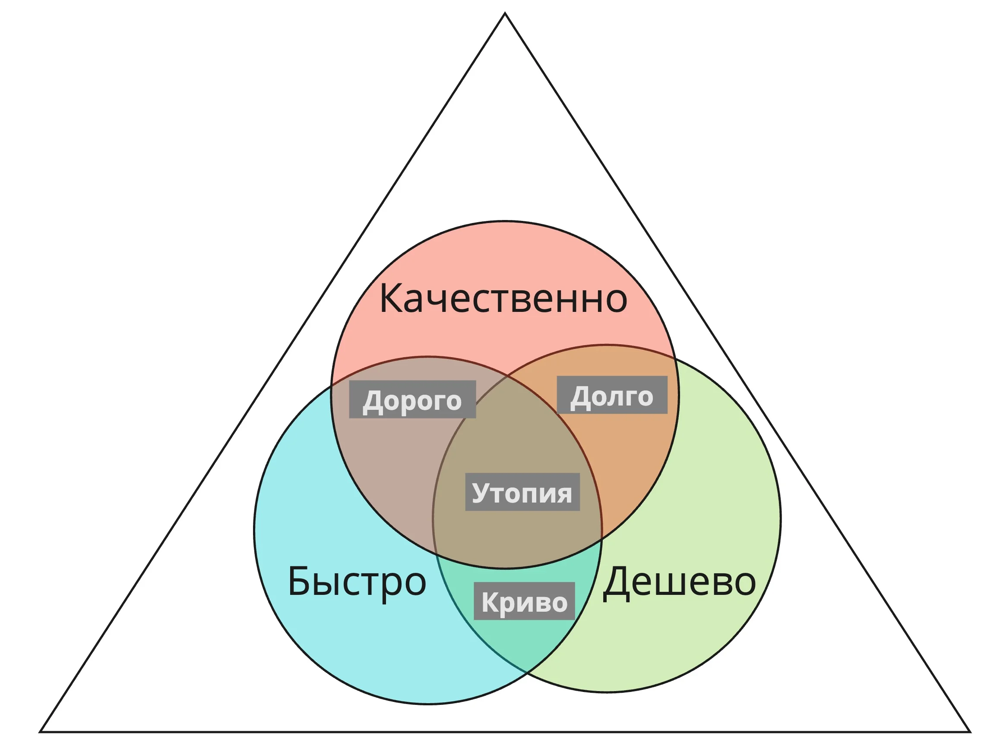


Оригинал опубликован в [Telegram](https://t.me/tarmolov_work/215)


В мире управления проектов все знают о классическом треугольнике [Качество. Скорость. Цена](https://ru.wikipedia.org/wiki/%D0%A2%D1%80%D0%BE%D0%B9%D1%81%D1%82%D0%B2%D0%B5%D0%BD%D0%BD%D0%B0%D1%8F_%D0%BE%D0%B3%D1%80%D0%B0%D0%BD%D0%B8%D1%87%D0%B5%D0%BD%D0%BD%D0%BE%D1%81%D1%82%D1%8C). 

Высокоуровнево у каждого проекта есть три основных ограничения: 
1. Бюджет.
2. Срок сдачи проекта.
3. Объем работ.

Чтобы выпустить проект с должным уровнем качества, менеджер либо сокращает количество задач в  проекте, либо увеличивает бюджет, либо сдвигает срок сдачи.

Я, как руководитель команды разработки, смотрю на три высокоуровневые метрики для оценки работы отдела разработки:

1. Скорость производства (как быстро новые фичи доставляются до продакшена)
2. Качество (количество багов)
3. Надежность (uptime и #инциденты)

Команда — большой молодец, если быстро поставляет новые фичи с минимумом багов и без деградации в надежности сервиса. Легко сказать и сложно сделать :)

Расскажу про каждую из метрик в отдельных постах.