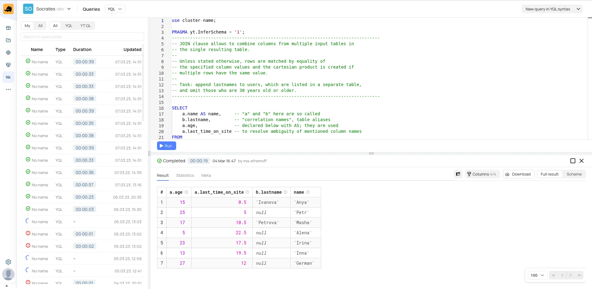


Оригинал опубликован в [Telegram](https://t.me/tarmolov_work/196)


В [прошлом посте](https://tarmolov.ru/posts/122-yt-yandeksovyy-mapreduce/) я упустил важную особенность, которая сделала YT настоящим хитом в Яндексе. Это Yandex Query Language (YQL) — декларативный и SQL-подобный язык запросов.

В далеком 2016 году Иван Блинков [опубликовал статью на Хабре](https://habr.com/ru/companies/yandex/articles/312430/) с подробными объяснениями предпосылок возникновения и принципов построения YQL. На скриншотах даже виден кластер `Hahn` ;)

Типы данных, синтаксис и встроенные функции YQL перечислены в [официальной документации](https://ytsaurus.tech/docs/ru/yql/). Однако я уверен, что читатели с опытом SQL смогут интуитивно написать правильный запрос, используя веб-редактор YQL.

Именно этот веб-интерфейс сделал возможным использование всей мощи YT даже коллегам-непрограммистам. Фактически, веб-интерфейс YQL выступает в роли [IDE](https://ru.wikipedia.org/wiki/IDE) и подсвечивает ошибки еще до запуска запроса.

Большой респект и +100500 в карму разработчикам YT за этот функционал.