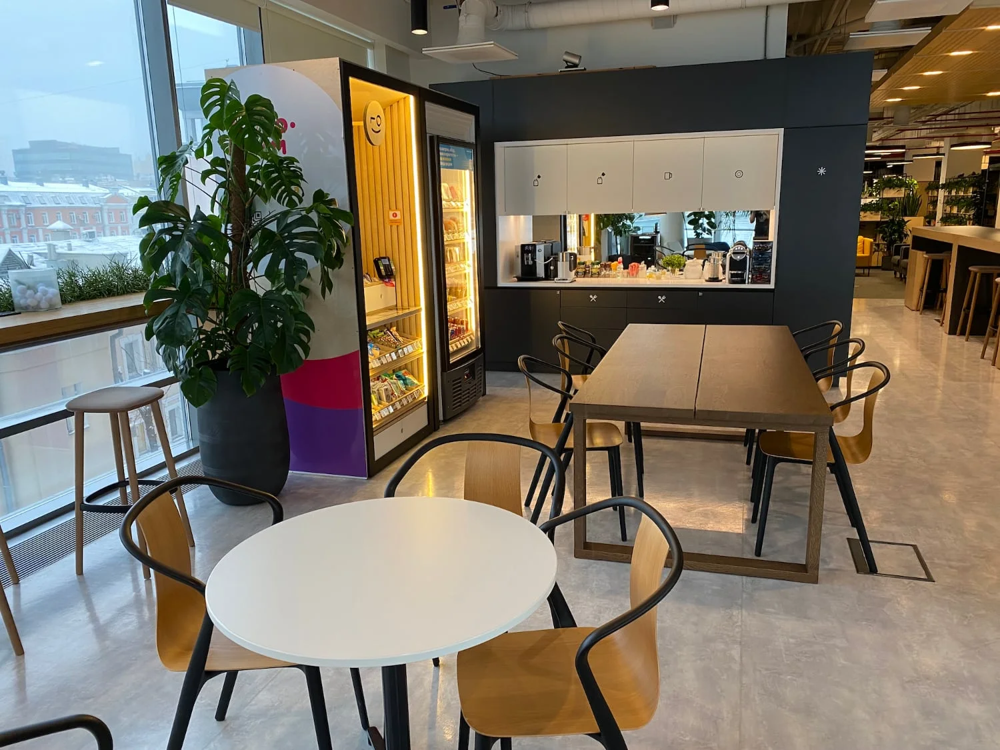


Оригинал опубликован в [Telegram](https://t.me/tarmolov_work/90)


  

Каждый этаж офиса Яндекса снабжен кофе-поинтами. Это такие точки притяжения коллег, где можно перекусить или выпить кофе.

Кофе-поинты также привносят в нашу жизнь "хаотичные коммуникации". Случайные встречи с коллегами позволяют решать рабочие вопросы, заводить новые знакомства и узнавать слухи.

Это то, по чему я скучал, когда мы ушли на полную удаленку в ковидное время. Я даже не подозревал, что такие случайные встречи на самом деле сильно помогают рабочему процессу.

Кстати, на фото лишь один из вариантов кофе-поинта. Все они — очень разные.