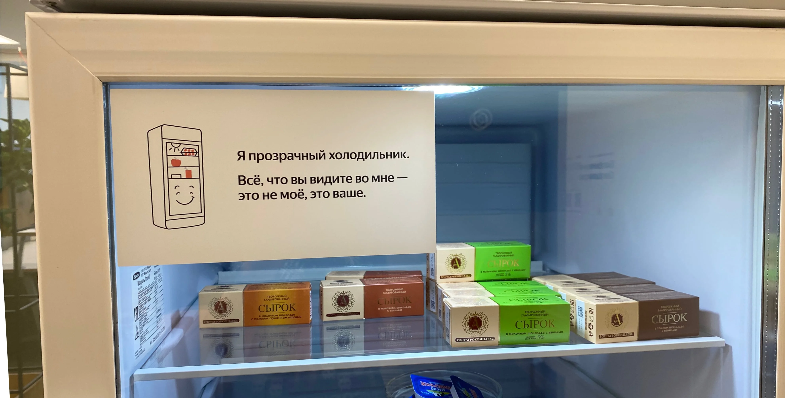


Оригинал опубликован в [Telegram](https://t.me/tarmolov_work/93)


[Наши хозяюшки](https://tarmolov.ru/posts/131-khozyayushki-i-ab-eksperimenty/) создают уют в наших офисах. Также хозяюшки — мастера по созданию условных рефлексов у сотрудников.

Они выставляют на кофе-поинтах различные вкусняшки по расписанию. Например, по средам в прозрачных холодильниках появляются сырки «А. Ростагрокомплекс», бывшие «Б.Ю. Александров».

Сырки по средам пришлись по душе сотрудникам, а некоторые ради них стали пораньше приходить в офис!

Управление с помощью вкусняшек — мощный инструмент в руках наших хозяюшек :)