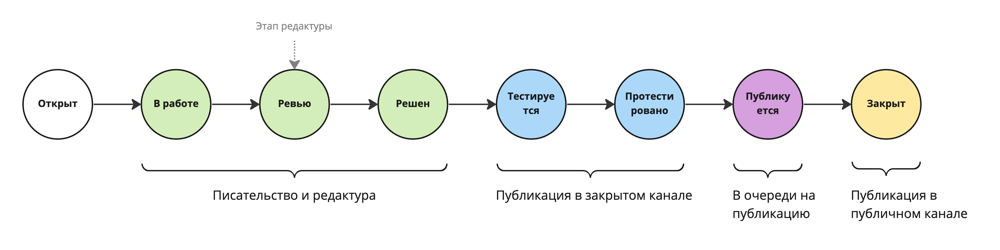


Оригинал опубликован в [Telegram](https://t.me/tarmolov_work/69)


 

Вот так выглядит адаптация статусов разработки в написание постов. 

Эта схема есть в [лонгриде](https://telegra.ph/Vedenie-bloga-v-YAndeks-Trekere-11-26), но решил ее продублировать в телеграме для наглядности.

Кстати, наверняка этот процесс можно и на строительство переложить :)