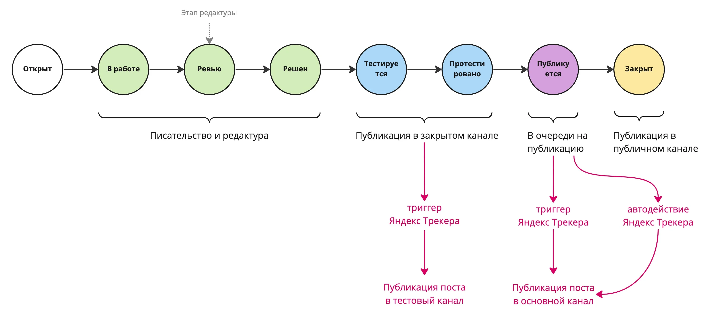


Оригинал опубликован в [Telegram](https://t.me/tarmolov_work/70)


Ведение блога в Яндекс Трекере добавляет накладные расходы по синхронизации Трекера с Телеграмом. Но к счастью, можно автоматизировать большую часть из них.

Для этого все есть:

* [API Яндекс Трекера](https://cloud.yandex.ru/docs/tracker/about-api) для получения информации о задачах
* [Cloud Functions](https://cloud.yandex.ru/docs/functions/operations/) в качестве хостинга
* [API Телеграма](https://core.telegram.org/bots/api) для отправки/редактирования постов

С помощью [триггеров](https://cloud.yandex.ru/docs/tracker/user/trigger) и [автодействий](https://cloud.yandex.ru/docs/tracker/user/autoactions) Яндекс Трекера можно переложить большинство рутинных действий на робота.

На каждое важное событие Яндекс Трекер шлет запросы в веб-хук в Яндекс Облаке. 

При переводе тикета в статус `Тестирование` пост публикуется в  тестовый канал, а при переводе в статус `Публикуется` — в основной канал.

Более подробно описал в [лонгриде](https://tarmolov.ru/posts/157-avtomatizatsiya-vedeniya-bloga/).