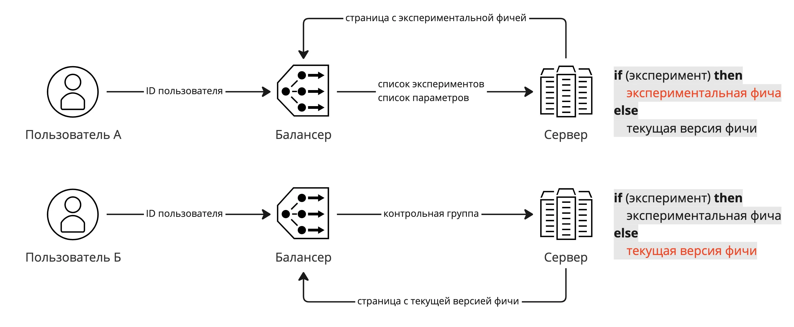


Оригинал опубликован в [Telegram](https://t.me/tarmolov_work/73)


На балансере определяется участие пользователя в эксперименте, и эта информация передается на сервер. На сервере написано условие для отдачи либо экспериментальной фичи, либо текущей версии без изменений. 

Важно отправлять пользователя в один и тот же эксперимент при каждом посещении сервиса. В противном случае интерфейс сервиса будет постоянно меняться и смущать пользователя.

Для этого мы каждому пользователю присваиваем некоторый идентификатор, по которому определяем, в какой эксперимент попал пользователь.