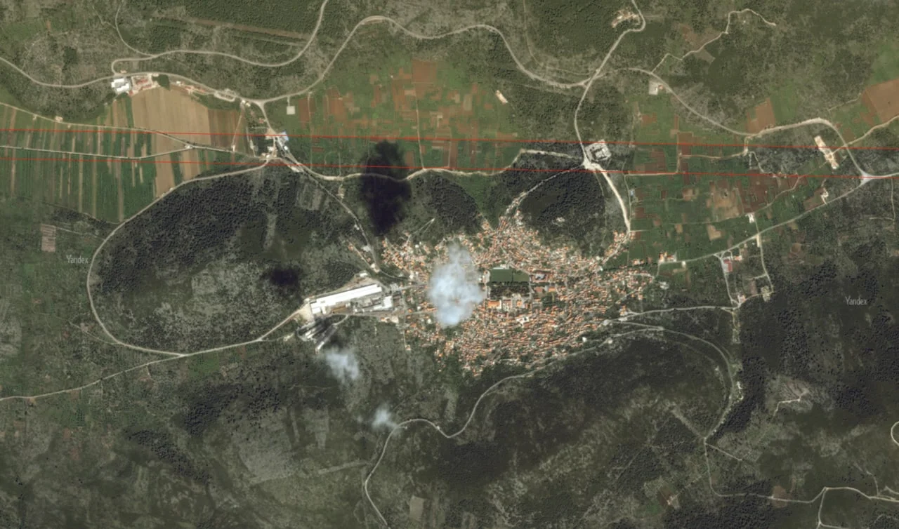


Оригинал опубликован в [Telegram](https://t.me/tarmolov_work/97)


Яндекс использует [спутниковые снимки](https://yandex.ru/company/technologies/satellite/) для создания цифровых карт местности. Спутник во время своего полета "фоткает" поверхность Земли. В этих снимках допускается до 10% облачности.

Иногда наши картографы обязаны формально принять спутниковые снимки, хотя облака закрывают весь или часть города.

Например, на снимке выше спутник заснял город Блато, а облако расположилось в самом его центре.

К счастью, со следующим пролетом спутника получили [безоблачный снимок этого города](https://yandex.ru/maps/-/CCUjuEFCOD). Пожелаем же спутникам безоблачной погоды, чтобы и дальше радовать наших пользователей :)