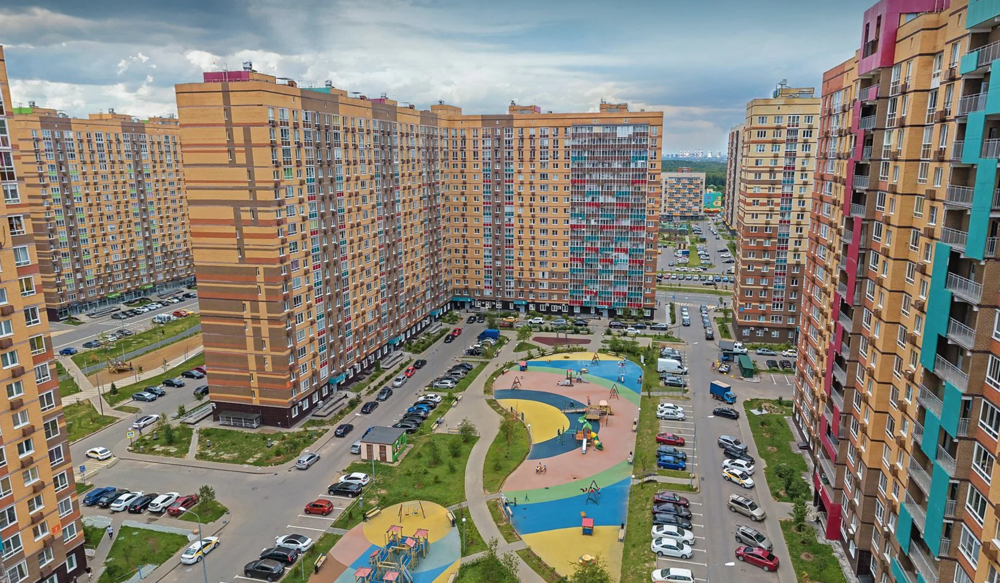


Оригинал опубликован в [Telegram](https://t.me/tarmolov_work/85)


На фотографии [Мисайлово](https://yandex.ru/maps/-/CCUjuMdjLD) — одна из самых крупных деревень Росиии.

Согласно [википедии](https://clck.ru/32qbaf) в 2010 году там жило 370 человек, а в 2021 — 27 тысяч человек.
Теперь при слове "деревня" не спешите представлять хутор с несколькими домами и лесом вокруг. Деревня может выглядеть по-другому ;)