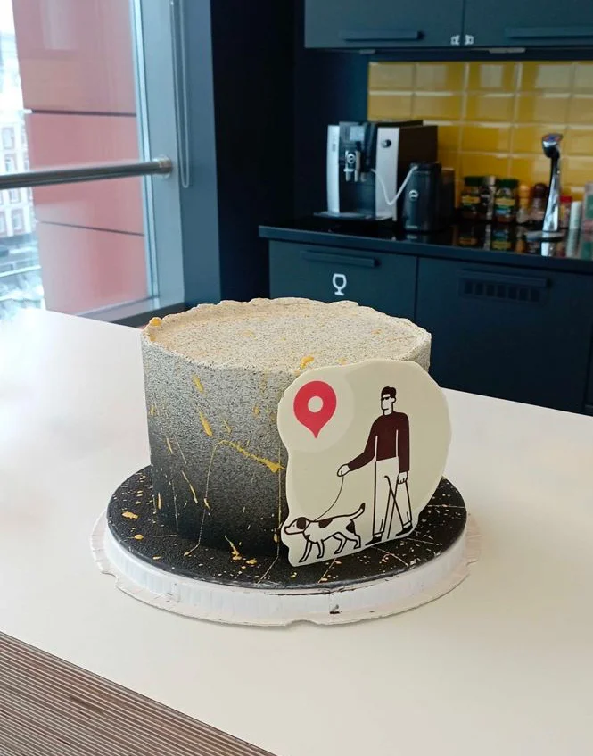


Оригинал опубликован в [Telegram](https://t.me/tarmolov_work/67)


 

Среди пользователей Яндекса есть незрячие люди. Они точно так же ищут информацию в интернете, вызывают такси и заказывают еду, но при этом взаимодействуют с компьютером или смартфоном с помощью вспомогательных технологий.

Мы хотим помочь незрячим пользователям решить свои задачи. Все больше наших сервисов [адаптируют](https://yandex.ru/blog/company/beaccessible) интерфейсы для данной категории пользователей.

Яндекс Карты — [один из сервисов](https://yandex.ru/support/beaccessible/blind.html), адаптированных для незрячих пользователей.

Сегодня всем таким сервисам Яндекса в качестве награды вручили особые тортики.

Хочу еще раз поблагодарить всех причастных за увеличение доступности наших сервисов. Спасибо!