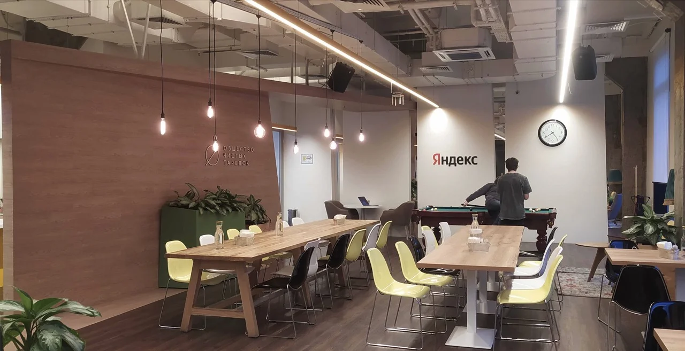


Оригинал опубликован в [Telegram](https://t.me/tarmolov_work/71)


Сотрудники компании для прохода в офисы используют бейджик. Им можно не только "пикнуть" при проходе через турникет, но и оплачивать еду в ближайших к офису кафе и столовых.

Самая лучшая столовая досталась питерскому офису. Меню поистине ресторанного уровня: гриль, стейки, сибас, завтраки с яйцами пашот, а также дни тематической кухни.

Такой результат стоил питерцам больших усилий:

* сменили 3-4 компании-оператора
* устраивали совместные дегустации
* корректировали меню
* собирали фидбек и учитывали все пожелания

В результате оператором питерской столовой стало [Общество чистых тарелок](https://cleanplatescafe.com/) с двумя кафе в Санкт-Петербурге. Теперь добавилось еще одно — эксклюзивно для сотрудников Яндекса.

Моя команда тестирования располагается в питерском офисе. Вкусно поесть — еще один повод приехать к ним в гости ;)

А после обеда можно и в бильярд сыграть...