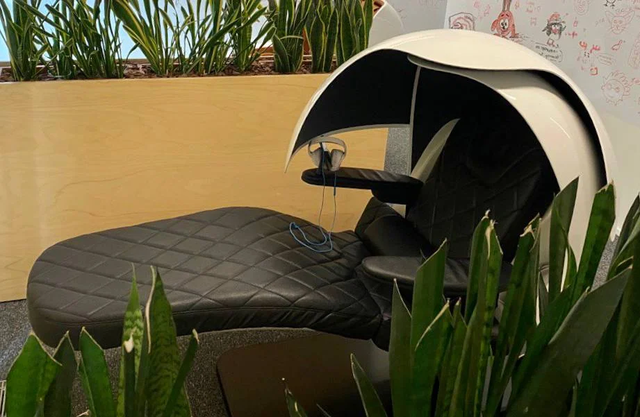


Оригинал опубликован в [Telegram](https://t.me/tarmolov_work/146)


Я ~~поступил~~ устроился в Яндекс во время учебы в университете. В то время я жил в студенческом режиме: утром учился, днем работал, ночью делал лабы и домашние задания.

Спать хотелось постоянно. Нескольких часов сна ночью и пары часов в транспорте не хватало. Поэтому, как и другие студенты, я был не прочь вздремнуть на лекциях. Мой знакомый даже приносил специальную подушку на лекции, чтобы было удобнее спать.

Один раз после бессонной ночи мне нужно было проработать целый день. Это был очень тяжелый день.

Но на самом деле мне был нужен всего лишь [power nap](https://ru.wikipedia.org/wiki/Power_nap) для восполнения энергии. К слову, [японцы знают в этом толк](https://ru.wikipedia.org/wiki/%D0%98%D0%BD%D1%8D%D0%BC%D1%83%D1%80%D0%B8).

В прошлом году у нас наконец-то появились капсулы для сна, где можно поставить таймер на 20 мин и сбить дремоту. Пока их немного. Но они пользуются спросом, и в будущем их количество точно увеличится.

Но лучше, конечно, высыпаться и пользоваться такими капсулами в крайних случаях ;)