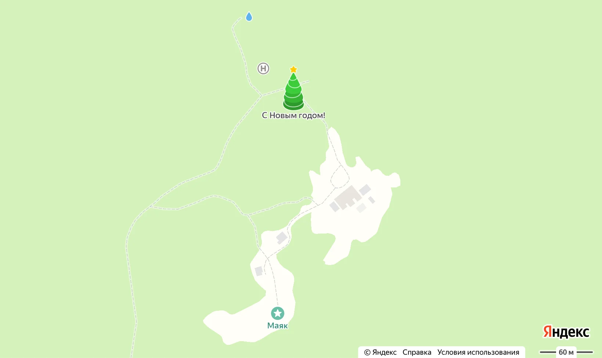


Оригинал опубликован в [Telegram](https://t.me/tarmolov_work/79)


Наша команда картографов занимается подготовкой к новому году очень глобально — ставит [новогодние елки](https://yandex.ru/maps/-/CCUryCQugC) прямо на картах. [Народные картографы](https://yandex.ru/blog/company/90803) помогают делать наши карты точнее, и поиск елок — [не исключение](https://yandex.ru/q/nmaps/12552299266/).

Общими усилиями мы добились, чтобы в наших картах можно было найти елки в России, Белоруссии, Эстонии, Сербии и других странах.

Одна из самых необычных заявок по добавлению новогодней елки пришла от **смотрителя маяка** с [острова Большой Тютерс](https://clck.ru/339h8f) в Финском заливе. Этот остров не такой большой, как может показаться из названия ;)

Дело в том, что на острове зарегистрировано только 2 человека. Встал вопрос, стоит ли публиковать елку на наших картах. Комитет новогодних елок долго думал и напряженно морщил лоб для принятия конечного решения…

Конечно, это шутка! Нам важен каждый пользователь, поэтому елку [добавили](https://yandex.ru/maps/-/CCUruTSOWC). Новогодних елок мало не бывает!