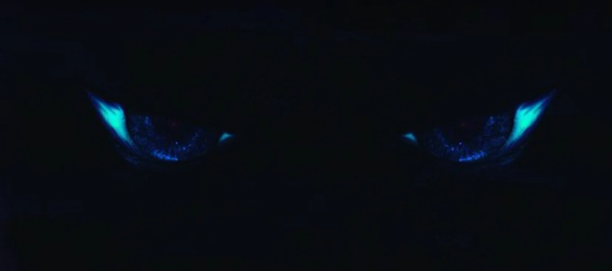


Оригинал опубликован в [Telegram](https://t.me/tarmolov_work/103)


В 2012 году Джеймс Кэмерон осуществил погружение на дно глубочайшей впадины мирового океана — в «Бездну Челленджера» (Марианская впадина).

Там, на дне, Кэмерон заснял материалы с помощью 3D-камеры. Это стало основой его нового шедевра — [Аватар: Путь воды](https://www.kinopoisk.ru/film/505898/).

У вас также есть возможность заглянуть в "бездну" на Яндекс Картах. И для этого необязательно спускаться на батискафе.

[Посмотреть пугающие подробности 😱](https://yandex.ru/maps/-/CCUzeRAMWA)