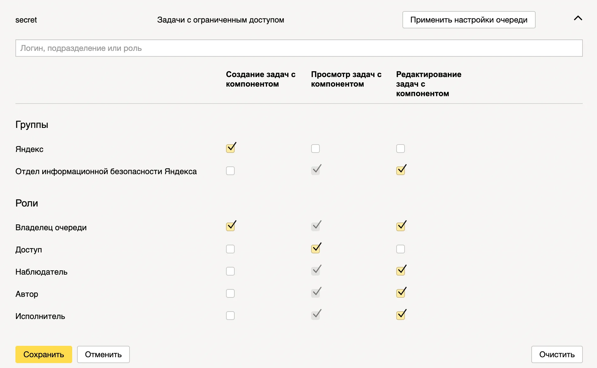


Оригинал опубликован в [Telegram](https://t.me/tarmolov_work/104)


Иногда в [трекере](https://cloud.yandex.ru/services/tracker) необходимо скрыть задачу от лишних глаз.

Делюсь маленьким лайфхаком, упрощающим этот процесс:

1. Создайте компонент `secret` с [ограниченным доступом](https://cloud.yandex.ru/docs/tracker/manager/queue-access#access-components).
2. Рекомендую сразу выдавать доступ службе безопасности своей компании.

Если доступ к задаче нужно ограничить, то добавляете компонент `secret` - и доступ автоматически ограничится узким кругом лиц.