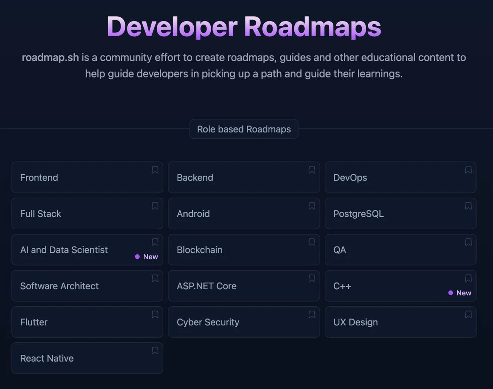


Оригинал опубликован в [Telegram](https://t.me/tarmolov_work/160)


Я уже [упоминал](https://tarmolov.ru/posts/62-o-razvitii-sotrudnikov/), что о своем развитии должен думать в первую очередь сам сотрудник.

Самое сложное — понять, в каком направлении сделать первый шаг.

Коллега поделился со мной интересным проектом с роадмапами для разработчиков. Они помогут структурировать свои текущие знания и наметить точки роста.

Я посмотрел несколько роадмапов, и они выглядят многообещающе.

📖 [Примеры роадмапов развития разработчиков](https://roadmap.sh/)

