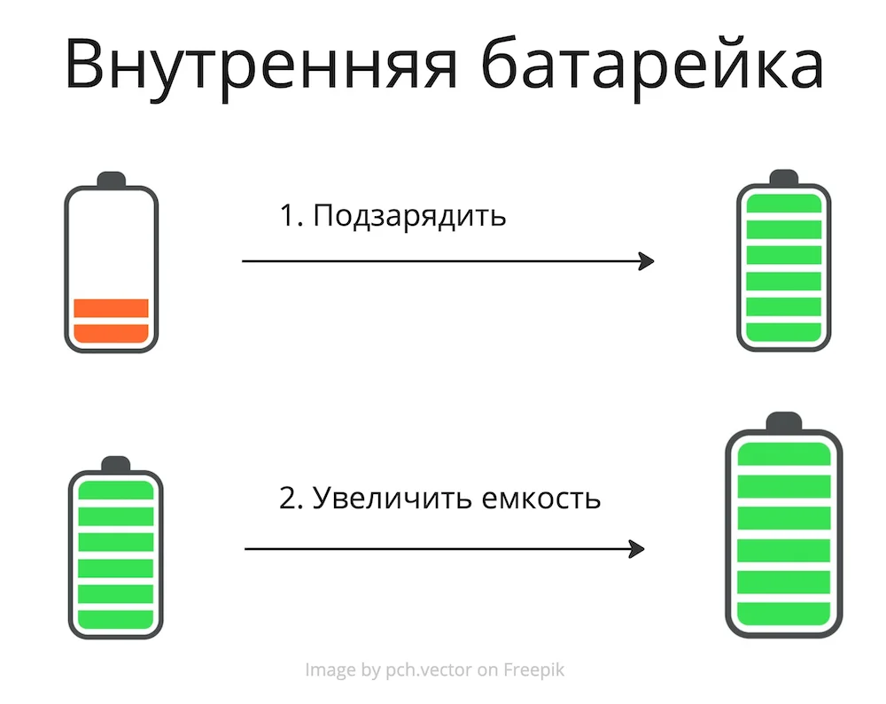


Оригинал опубликован в [Telegram](https://t.me/tarmolov_work/183)


Перед тем как ввязываться в новую карьерную авантюру, нужно запастись энергией — ["быть в ресурсе"](https://tarmolov.ru/posts/56-resursnoe-i-neresursnoe-sostoyanie/).

Можно провести аналогию с автомобильным путешествием: пройти техобслуживание, проверить запасное колесо и, конечно, заправить полный бак бензина. У человеческого организма также есть "внутренняя батарейка".

При полном заряде батарейки мы активно трудимся и радуемся жизни, если энергии не хватает — хочется спать и лениться.

Каждый из нас заранее должен позаботиться о способах подзарядки внутренней батарейки.

Если вы не знаете, что вас подзаряжает, начните с "классических" способов:

1. Обследование организма.
2. Здоровый сон.
3. Правильное питание.
4. Спорт.
5. Встречи с друзьями.
6. Хобби.

Чтобы хорошо работать, нужно хорошо отдыхать.

Если уделять должное время отдыху и маленьким радостям жизни, то емкость вашей батарейки увеличится. 

В итоге энергии станет достаточно для новых карьерных подвигов!