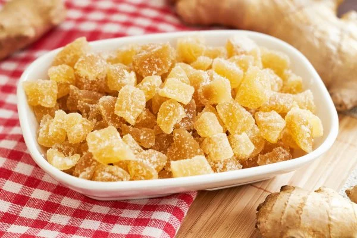


Оригинал опубликован в [Telegram](https://t.me/tarmolov_work/127)


Время от времени буду делиться с вами цитатами из жизни яндексоидов. Некоторые из них поучительные, некоторые смешные, некоторые просто жизненные.

Цитата 7-летней давности нашего коллеги:
— У нас сегодня на кофепоинте появился засахаренный имбирь. Берегись! Он выглядит как что-то ОЧЕНЬ ВКУСНОЕ, как цукаты. Как какой-то натуральный продукт. Я сразу взял себе самый большой кусок, вот такой. И откусил половину. А вокруг куча народу стоит. И тут я понимаю, что это имбирь. А все как будто на меня смотрят. Пришлось жевать и не подавать виду.