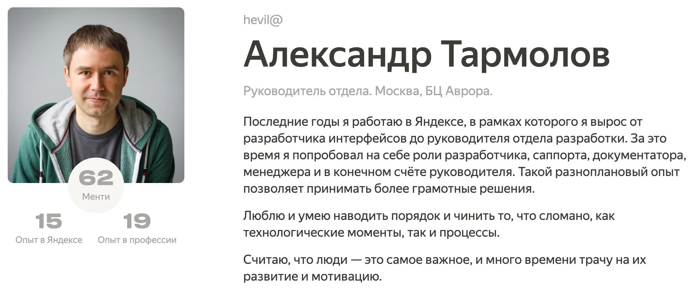


Оригинал опубликован в [Telegram](https://t.me/tarmolov_work/182)


Я участвую во [внутренней программе менторства](https://tarmolov.ru/posts/55-o-mentorstve/) более двух лет и возглавляю топ активных менторов в Яндексе. За это время ко мне обратилось 60+ человек.

Для коллаборации с менти я использую платформу [Miro](https://miro.com/):
* приватная доска с доступом только у ментора и менти
* каждая встреча — фрейм с текущей датой для отслеживания истории встреч
* во время встречи записываю основные мысли в Miro
* вопросы, ссылки, книги, видео и домашка — тоже туда

Такой подход позволяет очень быстро освежить в памяти последнюю беседу и пойти дальше. Иногда ко мне возвращаются через год, и такие конспекты сильно выручают.

Все заметки между мной и менти — строгое NDA. Все обсуждения остаются только между нами, ничего не выносим наружу. 

Некоторые мои советы повторялись и зарекомендовали себя в качестве полезных напутствий. Поэтому я решил публиковать наружу обезличенные советы, которые могут еще кому-то пригодиться.