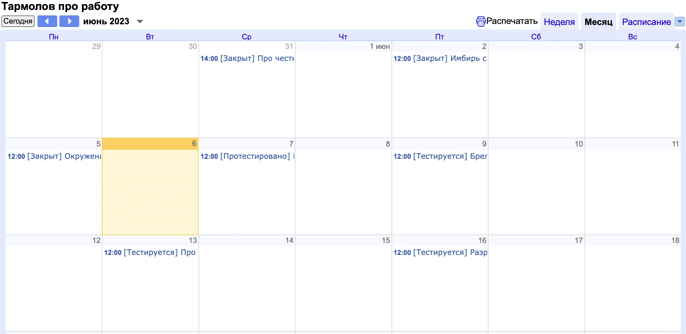


Оригинал опубликован в [Telegram](https://t.me/tarmolov_work/142)


Этот канал использует [самописную платформу](https://tarmolov.ru/posts/157-avtomatizatsiya-vedeniya-bloga/), которая связывает Яндекс Трекер и Телеграм. Она помогает мне ежедневно создавать, проверять и публиковать посты.

Необходимо подчеркнуть, что такие небольшие автоматизации значительно экономят [ментальную энергию](https://tarmolov.ru/posts/32-ekonomiya-mentalnoy-energii-cherez-avtomatizatsiyu/). После создания автоматизации один раз, она радует меня каждый день :)

Однако совершенству нет предела. Для упрощения планирования будущих постов я добавил интеграцию с календарем, и это заняло всего 100 строчек кода!

Теперь после установки даты публикации, событие автоматически появляется в календаре. Получился технологичный контент-план!

Таким образом постепенно я продолжаю разрабатывать платформу для ведения телеграм-канала. Возможно в будущем она станет настолько полноценной, что можно будет опубликовать ее в открытом доступе (open-source).