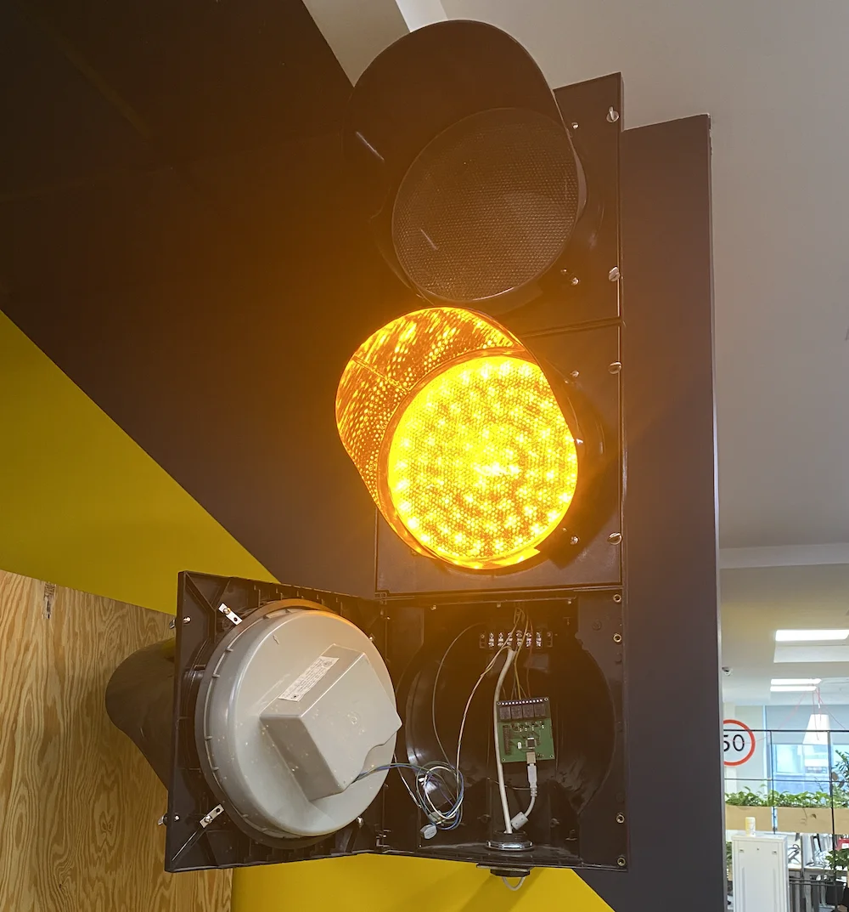


Оригинал опубликован в [Telegram](https://t.me/tarmolov_work/156)


 
Сегодня предлагаю вам заглянуть внутрь [нашего светофора](https://tarmolov.ru/posts/129-istoriya-svetofora/).

Все просто, как 3 копейки:
* Зеленый, желтый и красный провода подключены к диодным матрицам.
* Сердце светофора — небольшая плата с 4 реле для переключения огней светофора.
* Белый провод с питанием 220 вольт.
* Еще один белый кабель для подключения к компьютеру.

Вот такая махонькая плата управляет нашим светофором :)

P.S. Более крупное фото с платой закину в комменты для желающих рассмотреть поближе.