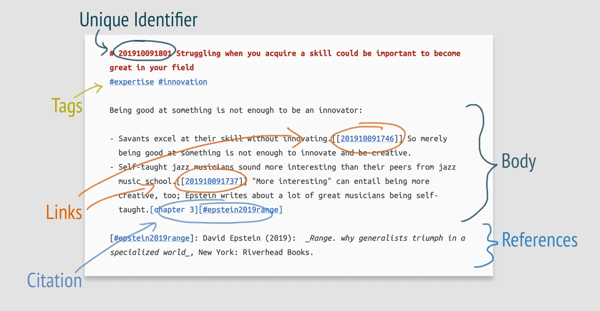


Оригинал опубликован в [Telegram](https://t.me/tarmolov_work/161)


Коллеги дали мне ссылку на подход ведения записей — [Zettelkasten Method](https://zettelkasten.de/). Эта методология позволяет структурировать цепочку своих записей для более эффективного повествования.

Самое интересное, что я интуитивно использовал этот метод в ведении блога через Яндекс Трекер:
* `Unique Identifier` —  ключ задачи в очереди
* `Tags` — теги и компоненты у задачи
* `Links` — связи задач
* `Body` — описание задачи
* `References` — комментарии к задаче с ссылками на материалы

И чем больше я читаю о Zettelkasten Method, тем больше нахожу сходства с моим текущим подходом. Все уже придумано до нас. Ну и они [хорошо продают](https://tarmolov.ru/posts/232-nuzhno-uchitsya-prodavat/) свой подход :)

Моя "реализация" Zettelkasten Method на базе Яндекс Трекера выглядит вполне конкурентноспособно и расширяемо. И это только первая версия!

К тому же Яндекс Трекер еще и бесплатный, в отличие от официального приложения Zettelkasten.