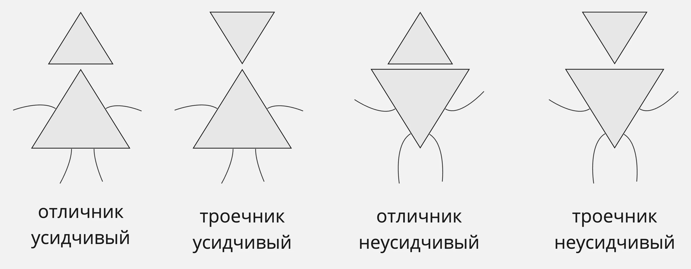


Оригинал опубликован в [Telegram](https://t.me/tarmolov_work/164)


На первом занятии по высшей математике в университете преподаватель [Феоктистов В.В.](http://fn.bmstu.ru/tm-fs-11/71-fn-dep/mat-modeling/general/persons/prepods/258-fn12-persons-feoktistov) нарисовал картинку человечков-треугольничков.

Уровень студентов на первом курсе был разным: от обычной школы до физмата. Для кого-то материал был новым, а кто-то его лишь повторял.

Основная идея преподавателя была следующей:
* усидчивых отличников обогнать невозможно, это гении
* неусидчивых троечников обычно отчисляют в первую очередь
* усидчивые троечники со временем обгоняют неусидчивых отличников

Так и оказалось. Самоуверенных неусидчивых отличников в итоге отчислили, а упорные троечники доучились и защитили дипломы. Но троечникам приходилось трудиться на порядок больше отличников. Подтверждаю этот факт, так как я был троечником.

Когда я пришел в Яндекс, то опять оказался троечником, так как меня окружали гораздо более умные и опытные коллеги. В итоге опять пришлось брать усидчивостью :)

Терпение и труд всё перетрут.