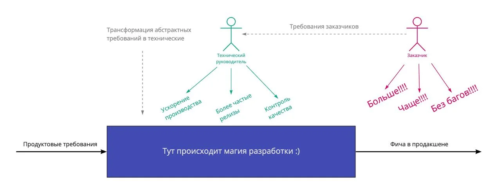


Оригинал опубликован в [Telegram](https://t.me/tarmolov_work/27)


  

Требования заказчика продукта можно сформулировать как “хочу шипить в продакшен больше фич, чаще и без багов”. Технический руководитель (например, я) выступает в качестве специальной прослойки к команде и переводит абстрактные продуктовые или бизнесовые требования в более технологическое русло.

На самом деле практически все наши менеджеры (в том числе и наш топ-менеджер) неплохо подкованны технически, поэтому с ними можно пообсуждать технические нюансы и как устроена #разработка. Но тем не менее нам технарям всегда нужно быть готовыми быть “техническим переводчиком”.