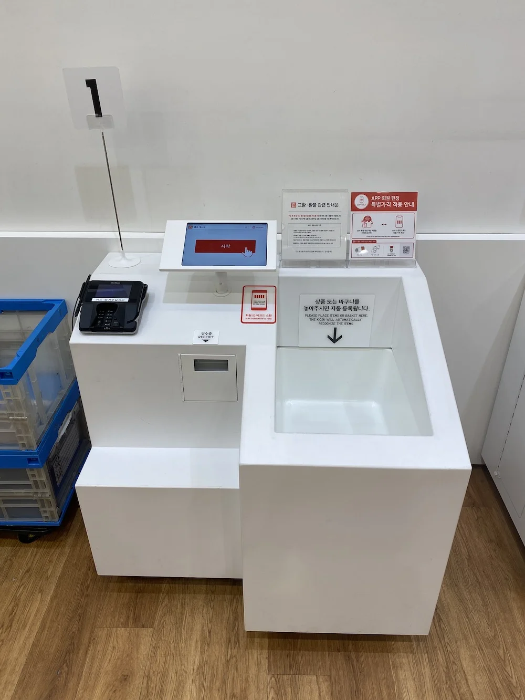


Оригинал опубликован в [Telegram](https://t.me/tarmolov_work/174)


Я люблю улучшения UX обыденных задач. Например, оффлайн похода за покупками. Не все же заказывать онлайн?

В 2017 году Amazon запустил [магазин без кассиров](https://en.wikipedia.org/wiki/Amazon_Go), но эти магазины [не прижились](https://clck.ru/36QKVf). Получилось технологично, но дорого для масштабирования.

Uniqlo итеративно улучшает текущий процесс. Ниже расскажу про свой недавний опыт.

Я набрал товары в корзинку и пошел к киоску самообслуживания. Приготовился "пропикивать" кучу разной мелочевки. Но ничего такого не произошло :)

Поставил корзинку в специальное углубление, а киоск сам определил список купленных товаров и вывел итоговую сумму к оплате. Магия!

Никакой магии, конечно, нет. Каждая вещь в Uniqlo снабжена пассивной RFID меткой с информацией о товаре. Киоск считывает RFID метки и производит простейшие арифметические действия.

Решение Uniqlo, в отличие от Amazon — простое и эффективное. И самое главное — легко масштабируемое на практически любые магазины.