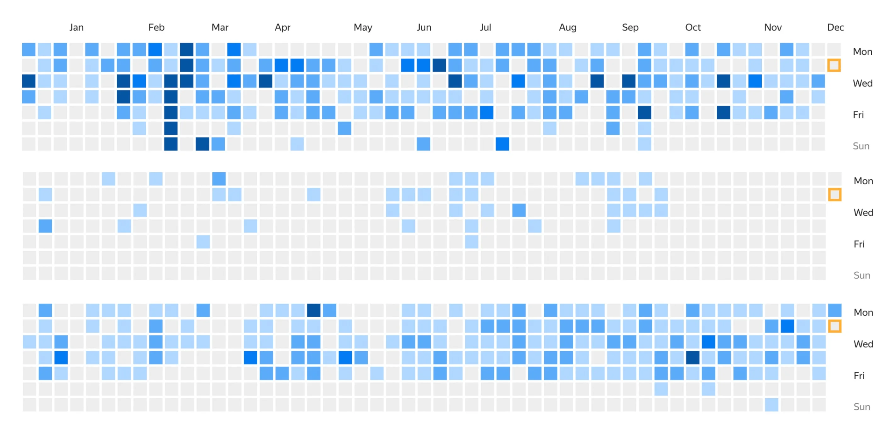


Оригинал опубликован в [Telegram](https://t.me/tarmolov_work/181)


Когда я стал руководителем отдела, то первое, что я сделал — пошел за советами к более опытным коллегам.

Один из руководителей дал мне такой совет: "Не переставай программировать". Руководитель группы не перестает программировать и порой не уступает в количестве коммитов своим сотрудникам.

Чем выше поднимаешься по административной иерархии, тем больше времени "жрут" различные руководительские активности. На программирование остается все меньше и меньше времени. Есть соблазн забросить программирование и сосредоточиться на управлении людьми.

Но в этом случае руководитель начинает отрываться от реальных проблем и запросов настоящих разработчиков. Это влияет на принимаемое решение.

Именно поэтому я продолжаю решать небольшие и несрочные задачки.

Думаю, что на картинке выше вы без труда найдете мою карту коммитов. Но с ходу непонятно, какая карта коммитов принадлежит разработчику, а какая — руководителю группы.