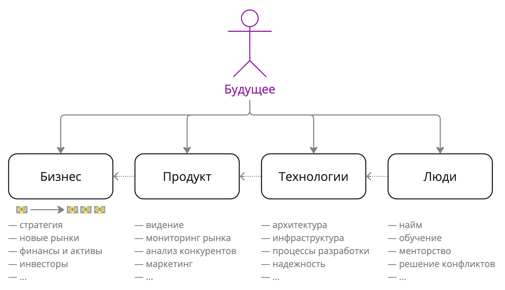


Оригинал опубликован в [Telegram](https://t.me/tarmolov_work/185)


Определить [видение своего будущего](https://tarmolov.ru/posts/57-prostoy-freymvork-dlya-razmyshleniy-o-karere/) — непростая задача. Если вы "буксуете" в этой задаче, то вы не одиноки.

На менторских встречах я обычно задаю наводящий вопрос: "Кто самый главный у технарей?". 

Обычно отвечают, что самый главный технарь — [технический директор](https://ru.wikipedia.org/wiki/%D0%A2%D0%B5%D1%85%D0%BD%D0%B8%D1%87%D0%B5%D1%81%D0%BA%D0%B8%D0%B9_%D0%B4%D0%B8%D1%80%D0%B5%D0%BA%D1%82%D0%BE%D1%80).

Технического директора (CTO) зовут в компанию для развития **бизнеса**. Напомню, что бизнес в моем понимании — машина по зарабатыванию денег, т.е. будущий CTO прежде всего должен помочь заработать больше денег.

Компания строит свой бизнес на основе какого-то **продукта**. CTO с помощью **технологий** повышает ценность этого продукта.

CTO не справится в одиночку, поэтому он строит вокруг себя сильную **команду**.

В итоге CTO должен обладать компетенциями в четырех направлениях: бизнес, продукт, технологии и люди.

Пусть эти направления будут для вас высокоуровневыми ориентирами для развития.