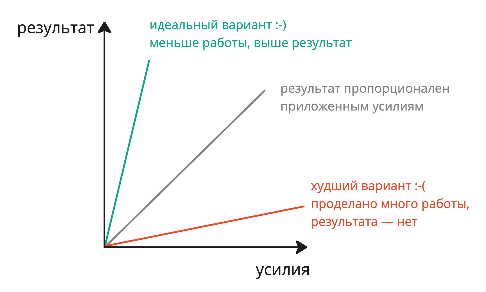


Оригинал опубликован в [Telegram](https://t.me/tarmolov_work/186)


 
Когда я рассказываю про [возможный высокоуровневый план развития](https://tarmolov.ru/posts/258-postroenie-plana-razvitiya/), некоторые коллеги зажигаются: "О! Интересны все направления! Попробую изучать все одновременно!".

Но все эти направления — разные миры. Если развиваться одновременно во всех направлениях, то будет расфокусировка. Результат в каждом из направлений будет незаметным, что ударит по нашей мотивации и дальнейшему движению вперед. В итоге получим красную траекторию на рисунке выше.

Конечно, хочется получить вариант с зеленой линией, где за меньшие усилия получаем более серьезный результат. Иногда так получается, но это скорее исключение, чем правило.

Нужно быть реалистами — стремиться получать результат, пропорциональный затрачиваемым усилиям.

Мой совет: сфокусируйтесь на 1-2 направлениях. Сконцентрированные усилия дают более значимый результат и приятное чувство удовлетворения от новых достигнутых высот :)