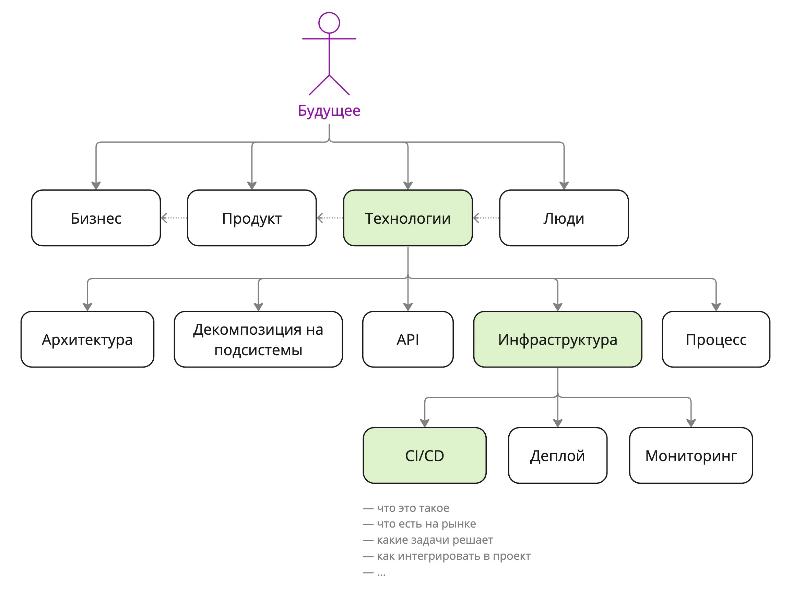


Оригинал опубликован в [Telegram](https://t.me/tarmolov_work/187)


Обычно [высокоуровневый план развития](https://tarmolov.ru/posts/258-postroenie-plana-razvitiya/) отвечает на вопрос "куда можно развиваться", но не отвечает — "что конкретно делать".

Чтобы ответить на второй вопрос, необходимо декомпозировать высокоуровневое направление.

Например, **Технологии** можно представить в виде освоения следующих навыков:
* создавать **архитектуру** сервиса и декомпозировать ее на подсистемы
* выбрать и разработать протокол общения между подсистемами — **API**
* выстроить **инфраструктуру** для разработки и запуска сервиса
* настроить **процесс** разработки, дежурств и разбора инцидентов

Далее берете следующий уровень, например, **инфраструктуру**. Ее также разбиваете на составляющие элементы.

Продолжайте до тех пор, пока не дойдете до какого-то атомарного и понятного элемента, например, **CI/CD**.

Для помощи можно использовать [готовые карты](https://tarmolov.ru/posts/214-karta-razvitiya-razrabotchikov/), но лучше потратить время и создать свою собственную уникальную карту.