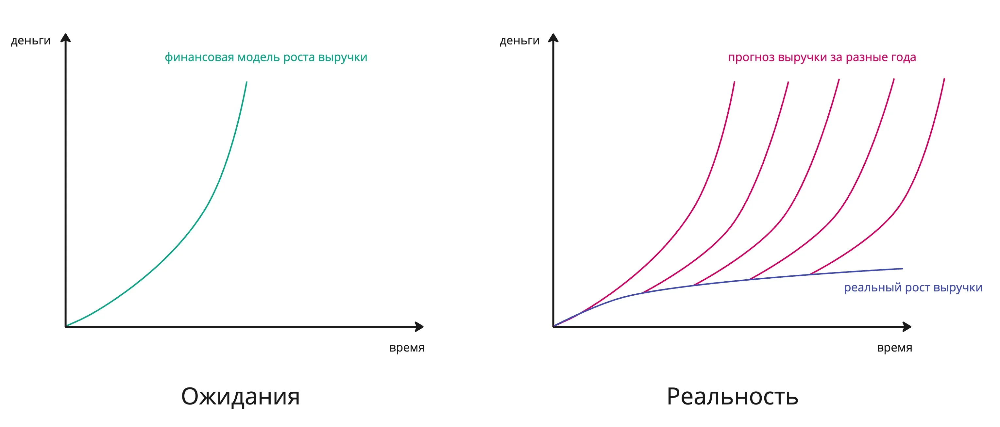


Оригинал опубликован в [Telegram](https://t.me/tarmolov_work/190)


"Да это же волосатая спина!" — воскликнул финансовый директор, увидев очередные поправки финансовой модели.

Ага, я тоже недоумевал, когда первый раз услышал это выражение. Но оно очень точное. Сейчас объясню.

В первые годы жизни стартапа обычно продают его будущее и подкрепляют свои обещания финансовыми моделями с экспоненциальным ростом выручки.

Однако часто будущее оказывается далеко не таким радужным, как в изначальном прогнозе. Выручка растет медленно. Чтобы привлечь дополнительное финансирование на развитие бизнеса, основатели компании продолжают продавать феноменальный рост денег. 

Но точка экспоненциального роста выручки каждый год смещается немного в будущее. И так повторяется год за годом.

В итоге реальная выручка на графике выглядит как "спина", а прогнозы выручек по годам выглядят как "волосы". Отсюда и родилась такая фраза на финансовом жаргоне — hairy back или в переводе на русский "волосатая спина" :)