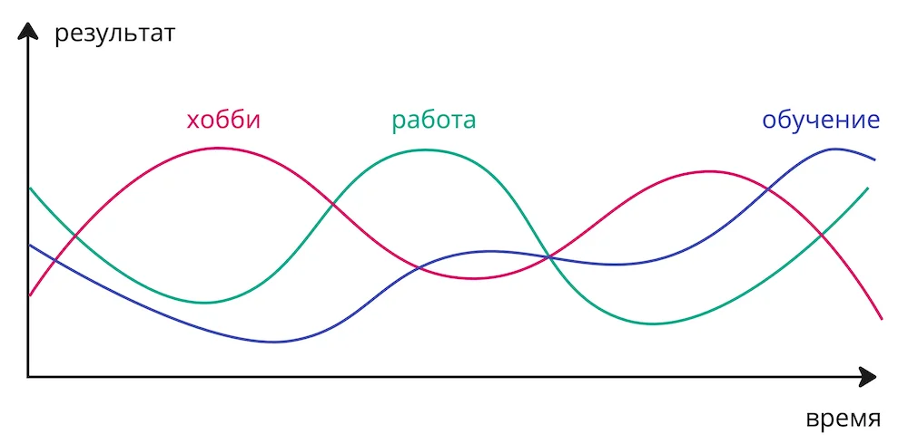


Оригинал опубликован в [Telegram](https://t.me/tarmolov_work/194)


Давайте немного поговорим про мотивацию.

Работа занимает примерно половину нашей жизни. Неудивительно, что взлеты и падения на работе ощутимо влияют на наше настроение. Успехи окрыляют, неудачи расстраивают. Так бывает со всеми нами.

Если основной источник счастья и удовлетворения — только работа, то любые неудачи на работе будут сильно влиять на мотивацию.

Своим менти я советую "не класть все яйца в одну корзину" и поискать для себя дополнительные источники, которые приносят удовлетворение и счастье. 

Мотивацию нужно черпать не только в работе, но и из других занятий. Например, из хобби, встреч с друзьями или прогулок по парку.

Это добавит вам энергии для преодоления непростого рабочего периода.

Например, когда я приходил на работу после утренних тренировок по теннису, то чувствовал себя молодцом еще до начала работы :)