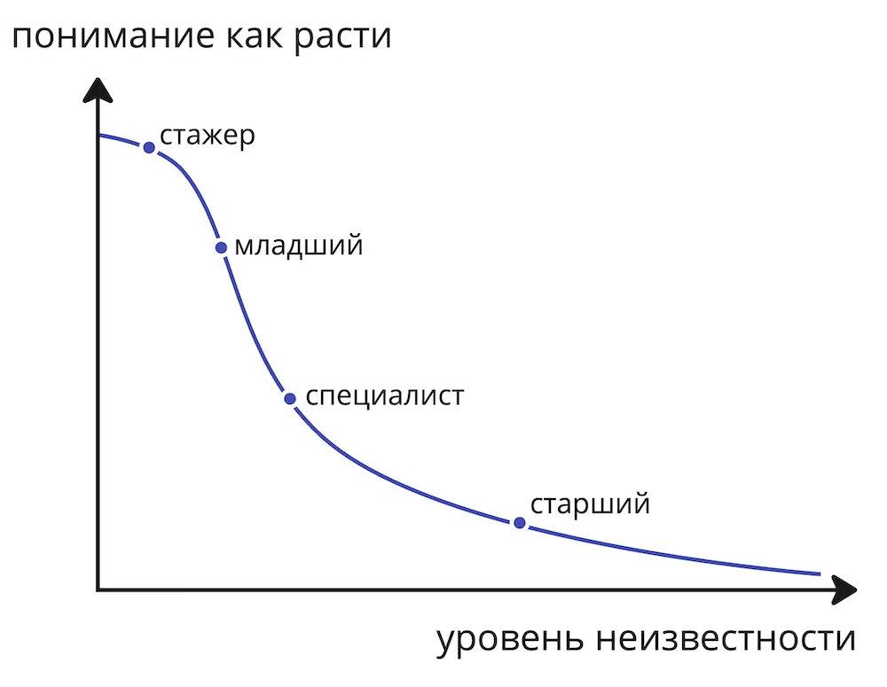


Оригинал опубликован в [Telegram](https://t.me/tarmolov_work/192)


Это график с ответом на вопрос: "Почему же так непонятно, куда и как расти?".

Уровень неизвестности растет по мере продвижения по карьерной лестнице. Чем выше вы взбираетесь, тем меньше понятных инструкций для дальнейшнего роста.

Я пока не встречал курсы по комплексному развитию руководителей отделов, а было бы неплохо :)

Также по мере роста вокруг вас уменьшается количество людей со схожими задачами и вызовами. Меньше людей, с кем можно посоветоваться. 

Сколько коллег поможет младшему разработчику с дебагом его кода? А кто подскажет СTO, как строить технологическую стратегию для работы нескольких сотен человек? Очевидно, что во втором случае выбор будет гораздо скромнее.

Поэтому не удивляйтесь временным паузам в своем дальнейшем развитии. Вы не одиноки. 

Ищите себе ментора или наставника, который поможет вам преодолеть эти временные затруднения. 

Всем бесконечного роста! :)