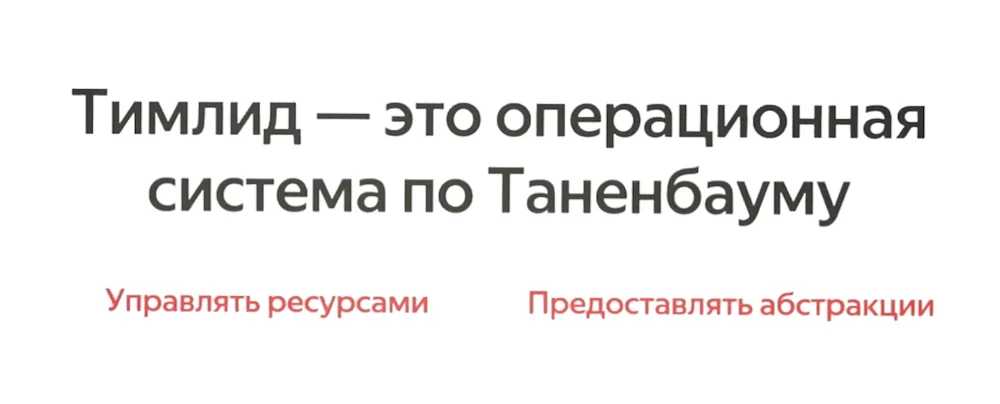


Оригинал опубликован в [Telegram](https://t.me/tarmolov_work/198)


В [докладе](https://yatalks.yandex.ru/ru/program/ty-govorish-chto-im-delat-a-oni-delayut-chto-khotyat) Алексея Штоколова на YaTalks наткнулся на интересную метафору: "Тимлид — это операционная система по Таненбауму".

Книга [Операционные системы](https://www.ozon.ru/product/sovremennye-operatsionnye-sistemy-4-e-izd-bos-herbert-tanenbaum-endryu-211432884/)  Эндрю Таненбаума — фундаментальный труд про принципы работы операционных систем (ОС).

ОС выполняет управление ресурсами и обеспечивает абстракции. Аналогично, тимлид управляет человеческими ресурсами команды и предоставляет две абстракции.

Для компании, тимлид представляет команду как работающую единицу, указывая на задачи, которые она может или не может решать. Команда принимается как "черный ящик" с определенными входами и выходами. 

Тимлид также переводит требования и язык смежников и бизнеса на понятный технический язык для команды. Это вторая абстракция. 

Метафоры как эта помогают объяснить мою работу, и я с удовольствием добавлю ее в свою коллекцию :)