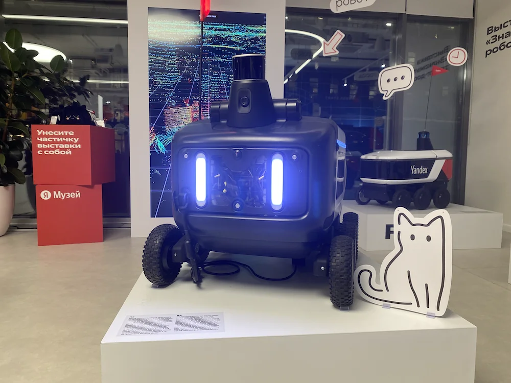


Оригинал опубликован в [Telegram](https://t.me/tarmolov_work/197)


В Москве и Санкт-Петербурге расположены [музеи Яндекса](https://t.me/yandexmuseum) со старой вычислительной техникой и игровыми автоматами. Например, там можно попробовать умножить числа с помощью [арифмометра Феликса](https://yandex.ru/museum/spb#feliks) или поиграть в [Sony Playstation 1](https://yandex.ru/museum/spb#sony-playstation-ps-ps1). 

В Яндекс Музеях также [проводят](https://yandex.ru/museum/events) экскурсии, мастер-классы и выставки.

Сейчас проходит выставка с самым мимимишным беспилотником — [роботом-доставщиком Яндекса](https://yandex.ru/museum/delivery_robots). Настоятельно рекомендую посетить!

Робот успешно трудится в качестве курьера, но иногда попадает в "переделки", и прохожие помогают ему выбираться то из сугробов, то из глубоких луж :)

На выставке можно увидеть несколько поколений роботов, изучить их комплектующие и посмотреть на себя «глазами» робота — через его [лидар](https://yandex.ru/blog/company/bespilotnyy-flot-yandeksa-pereshel-na-sobstvennye-lidary-pochemu-eto-vazhno-i-chto-v-nikh-osobennogo)! 

На фото за ровером установлен экран. На нем можно рассмотреть небольшую красную зону. Так воспринимал меня ровер, когда я его фотографировал :)

P.S. Небольшой фотоотчет оставлю в комментариях.