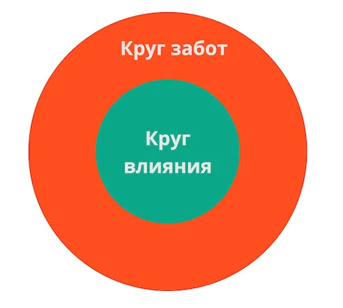


Оригинал опубликован в [Telegram](https://t.me/tarmolov_work/209)


Мне тут коллеги сказали, что я очень люблю "кружочки", т.к. при объяснении чего-либо часто рисую схемки — и кружочки, в частности.

На одной из встреч отдела я рассказывал о своем отношении к работе и о том, как неидеальную работу превращать в идеальную.

Тогда я поделился концепцией [Стивена Кови](https://tarmolov.ru/posts/225-stiven-kovi-7-navykov-vysokoeffektivnykh-lyudey/) про два кружочка:
* Красный кружочек "Круг забот" — то, что нас беспокоит, но повлиять на это мы не можем. Например, погода за окном.
* Зеленый кружочек "Круг влияния" — то, на что мы можем повлиять. Например, мигающая лампочка в подъезде.

**Совет простой:** растить зеленый кружочек и уменьшать красный :)

Не тратьте время и силы на то, что за пределами вашего круга влияния. Лучше сосредоточьтесь на том, что вы действительно можете изменить. И действуйте.