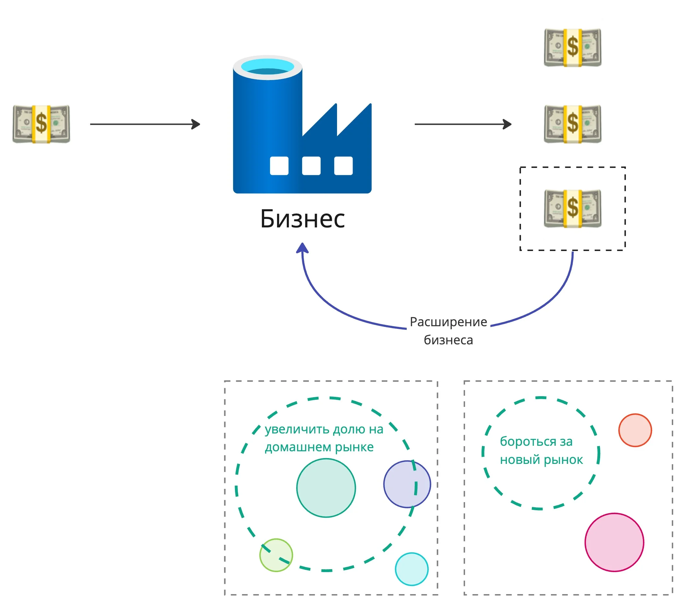


Оригинал опубликован в [Telegram](https://t.me/tarmolov_work/210)


Я уже [рассказывал](https://tarmolov.ru/posts/67-nichego-lichnogo-eto-prosto-biznes/) о том, что каждый сотрудник должен помогать бизнесу расти. Обычно компания часть своей заработанной прибыли отправляет на свое развитие и рост. Если компания остановится в росте, то погибнет в конкурентной борьбе.

Бизнес — агрессивная среда, напоминающая игру [Agar.io](https://ru.wikipedia.org/wiki/Agar.io), в которой кружочки борются за выживание. Бизнесы также объединяются, разделяются и "поедают" друг друга.

Соответственно, у бизнеса, как у организма, всего два пути:
1. Расширяться на своем локальном рынке.
2. Выходить на новые рынки.

Одна картинка стоит тысячу слов, поэтому делюсь с вами еще одной наглядной иллюстрацией вышеописанных слов. Опять кружочки :)