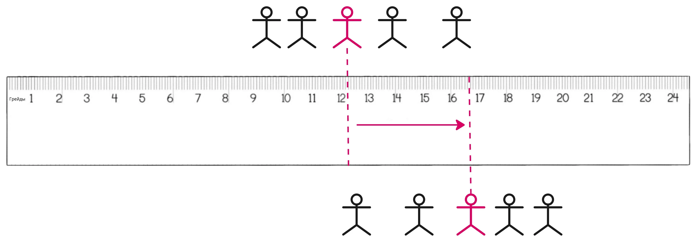


Оригинал опубликован в [Telegram](https://t.me/tarmolov_work/221)


Разговор на одной из [калибровок](https://tarmolov.ru/posts/34-4-kalibrovki/):
— У тебя младший специалист на своем грейде уже 2 года. Нет заметного роста.
— Мне норм. У меня есть задачи для его грейда.

Может казаться, что в команде задачи только для младших специалистов. Но если такие задачи поручить старшим, произойдет маленькое чудо.

Старший специалист будет лениться решать простые задачи и либо решит "мета-задачу", либо создаст платформу, упрощающую их решение.

Получается win-win ситуация:
* сотрудники [развиваются](https://tarmolov.ru/posts/259-razvivaemsya-fokusirovanno/), решают все более сложные задачи и становятся ценнее на рынке
* руководитель получает более сильную команду и может делегировать ей все больше своих задач :)

Мой руководитель очень емко сформулировал идею выше: **сдвигайте медиану компетенций вправо по [линейке грейдов](https://tarmolov.ru/posts/28-lineyka-greydov/)**.
