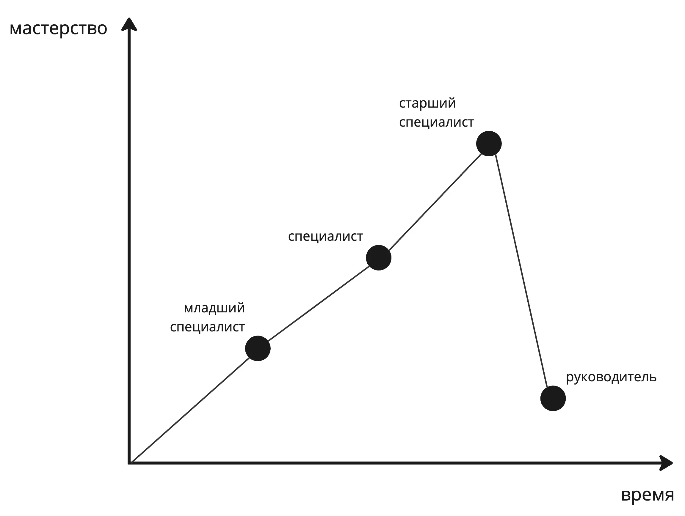


Оригинал опубликован в [Telegram](https://t.me/tarmolov_work/228)


Год назад я [писал заметку](https://tarmolov.ru/posts/66-chto-menyaetsya-kogda-stanovishsya-rukovoditelem/) про то, что когда становишься руководителем, то очень многое меняется.

Разработчики, которые органически вырастают до руководителя, думают, что это просто следующая ступенька после старшего специалиста. Но это не так.

Фактически вы переходите в новую для себя область и становитесь своего рода руководителем-стажером. Т.е. вам нужно заново наращивать компетенции.

Одна из распространенных ошибок начинающих руководителей — нежелание это признавать. Потому что "ну не просто же так меня повысили до руководителя?". Но на самом деле новому ремеслу нужно учиться так же, как и программированию.

Ну если вы, конечно, хотите стать хорошим руководителем.