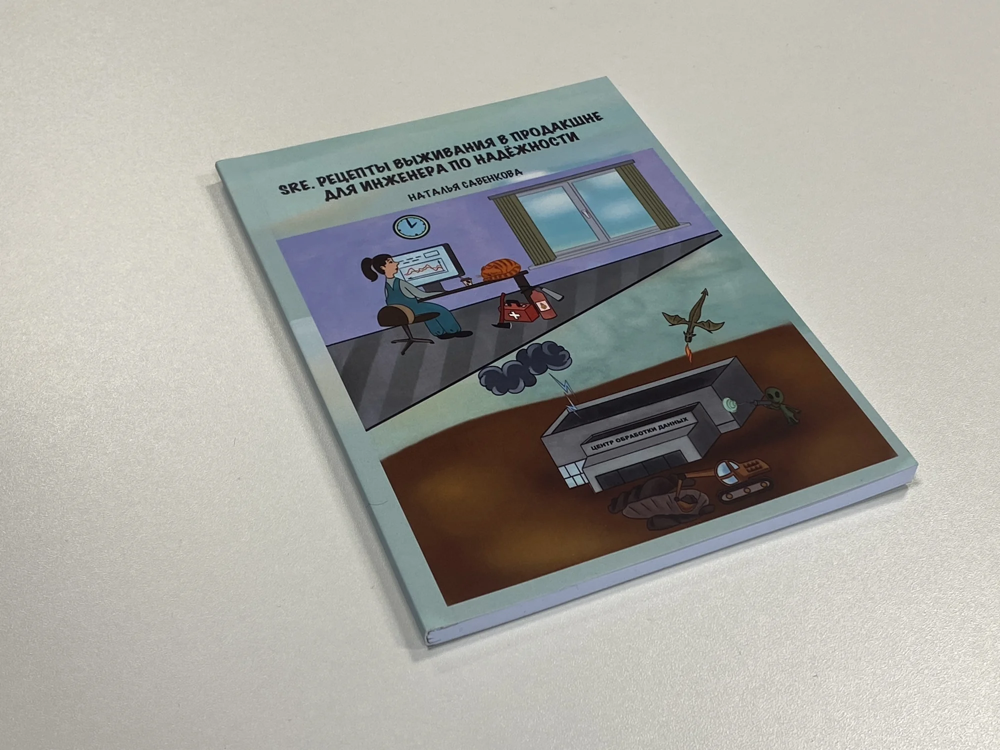


Оригинал опубликован в [Telegram](https://t.me/tarmolov_work/238)


Книга — лучший подарок, особенно если это [SRE. Рецепты выживания в продакшне для инженера по надежности](https://www.litres.ru/book/natalya-savenkova/sre-recepty-vyzhivaniya-v-prodakshene-dlya-inzhenera-po-70232503/) Наташи Савенковой. Мне посчастливилось получить её от самого автора.

Эта книга — квинтэссенция опыта из жизни яндексового SRE, без лишней воды, кратко и по делу.

В [инциденте с переносом строки](https://tarmolov.ru/posts/78-zlopoluchnyy-perenos-stroki/) wwax@ отреагировала быстрее, чем моя команда, из-за правильно настроенной инфраструктуры и мониторингов.

Наташа за время своей работы в Яндексе повидала множество разных инцидентов и много вкладывалась в повышение надежности как в своих сервисах, так и на уровне компании, распространяя полезные практики в этушке.

Книга — компактная и легко читается за вечер. Рекомендую её всем, кто стремится к повышению надёжности своих сервисов.