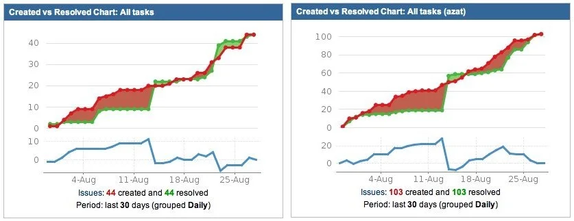


Оригинал опубликован в [Telegram](https://t.me/tarmolov_work/239)


Нашел свой пост в этушке от 2012 года про измерение своей эффективности с помощью отчета "Created vs. Resolved" в Jira. 

Нужно было делать так, чтобы зеленого (решенного) было больше, чем созданного (красного).

Вначале соревновался сам с собой, а потом добавил график своего руководителя для сравнения. И ужаснулся, т.к. его результат был в 2.5 раза лучше :)

Несмотря на то, что задачи никак не нормировались и метрику можно было обмануть, это помогало мне оценить свою продуктивность.

**Количество решенных задач или коммитов может служить неформальной метрикой собственной эффективности.** 

Но, конечно, важно не только СКОЛЬКО вы решаете задач, но и КАКИЕ именно и с КАКИМ качеством.

Спустя два месяца после публикации поста я стал руководителем группы. Может совпадение, а может быть из-за того, что [много фигачил](https://tarmolov.ru/posts/292-kak-rasti-mladshim-greydam/).