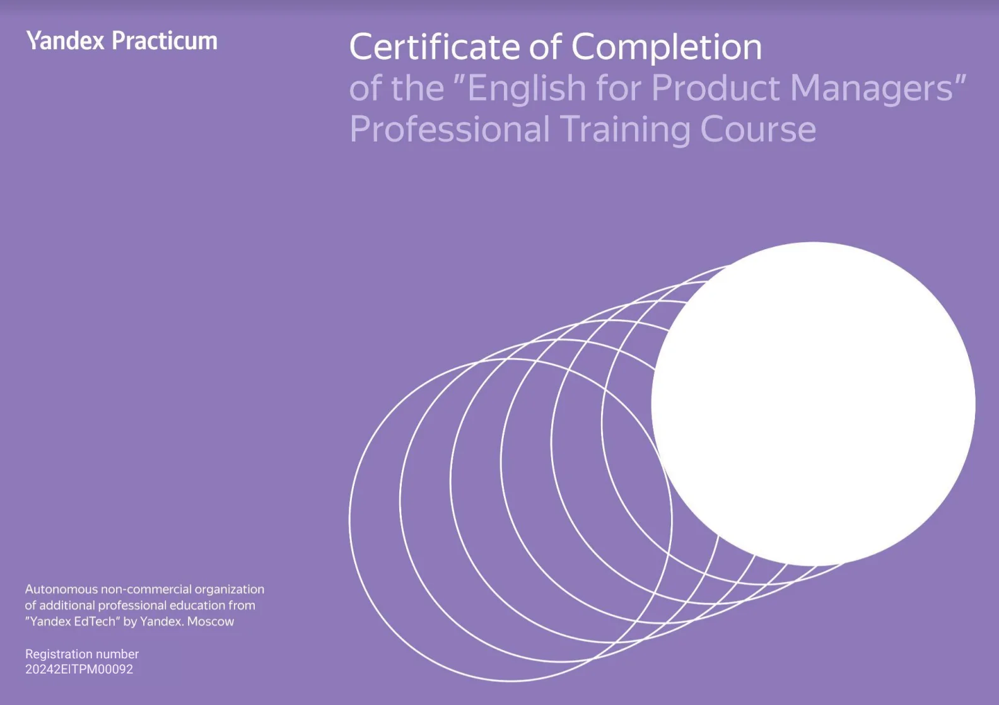


Оригинал опубликован в [Telegram](https://t.me/tarmolov_work/240)


Я недавно завершил [курс английского для менеджеров продукта](https://practicum.yandex.ru/english/english_for_products/), чтобы и английский подтянуть, и немного про менеджмент узнать.

> Hit two birds with one stone ;)

Выбрал я этот курс неслучайно. Мой бывший сотрудник стал руководителем Практикума Английского. Поинтересовался ее мнением. Сказала, что курс для продактов хвалили и стоит сходить.

Наполнение курса — отличное: рабочие кейсы, собеседования, нетворкинг, применение популярных фреймворков для структурирования ответов. Много практики и отработка пройденных ситуаций как с русскоязычным преподавателем, так и с иностранным.

Курс рекомендую. Если еще делать домашнюю работу и самостоятельно прорабатывать пройденный материал, то будет совсем хорошо.

P.S. Вообще может уже пора китайский учить?