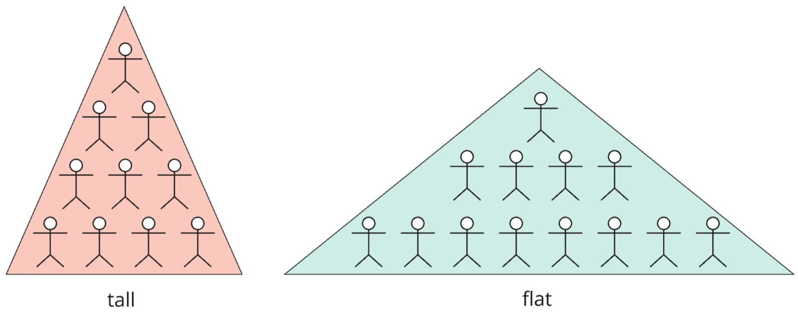


Оригинал опубликован в [Telegram](https://t.me/tarmolov_work/242)


  
Разговаривал на работе про [span of control](https://en.wikipedia.org/wiki/Span_of_control) и захотел поделиться с вами.

**Span of control (SOC)** — это количество неруководителей поделить на количество руководителей, т.е. этот коэффициент показывает среднее количество прямых подчиненных у руководителя.

Выделяют два вида организаций:
1. Иерархичные (tall) — низкое значение SOC.
2. Плоские (flat) — высокое значение SOC.

В иерархичных структурах больше контроля за процессами и качеством, но плоские структуры выигрывают в гибкости, творчестве и адаптации к изменениям.

Значения SOC у крупных компаний не являются публичной информацией, но утверждается, что компании с высокой капитализацией (такие как Google, Netflix, Microsoft) придерживаются плоской структуры.

Если равняться на техногигантов, то нужно стремиться к значению SOC в районе 6-12.

Вот поэтому наши hr не согласовывали создание подразделений меньше 5 человек. Чтобы растить SOC и вместе с ним эффективность.
