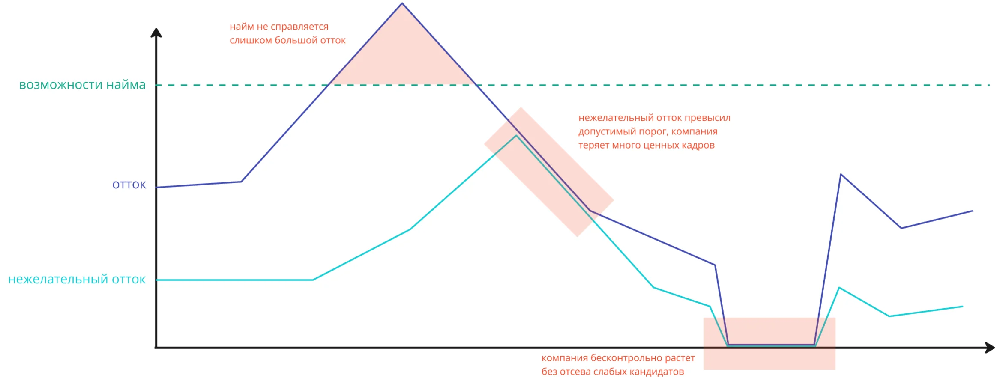


Оригинал опубликован в [Telegram](https://t.me/tarmolov_work/245)


Нанять с первого раза одного подходящего кандидата — непростая задача, а если нужны десятки таких людей, то задача становится невозможной.

Поэтому каждая компания "просеивает" через себя кандидатов:
* **нанимает** новых сотрудников с помощью команды рекрутмента
* часть кандидатов остаются в компании
* а часть сотрудников покидают компанию, формируя **отток**

В оттоке еще выделяют **нежелательный отток**. Это сотрудники, которых компания хотела бы оставить, но они все равно решили уйти.

Какой у вас найм?
Какой отток? А нежелательный отток?
Какие средние показатели по отрасли?

Ответы на эти вопросы позволят оценить эффективность работы HR-директора и качество построенного HR-бренда.

HR-директор должен контролируемо снабжать компанию сильными кадрами для ее роста и минимизировать нежелательный отток.

Но сделать это совсем непросто :)

P.S. В первом комменте еще добавил своих рассуждений.