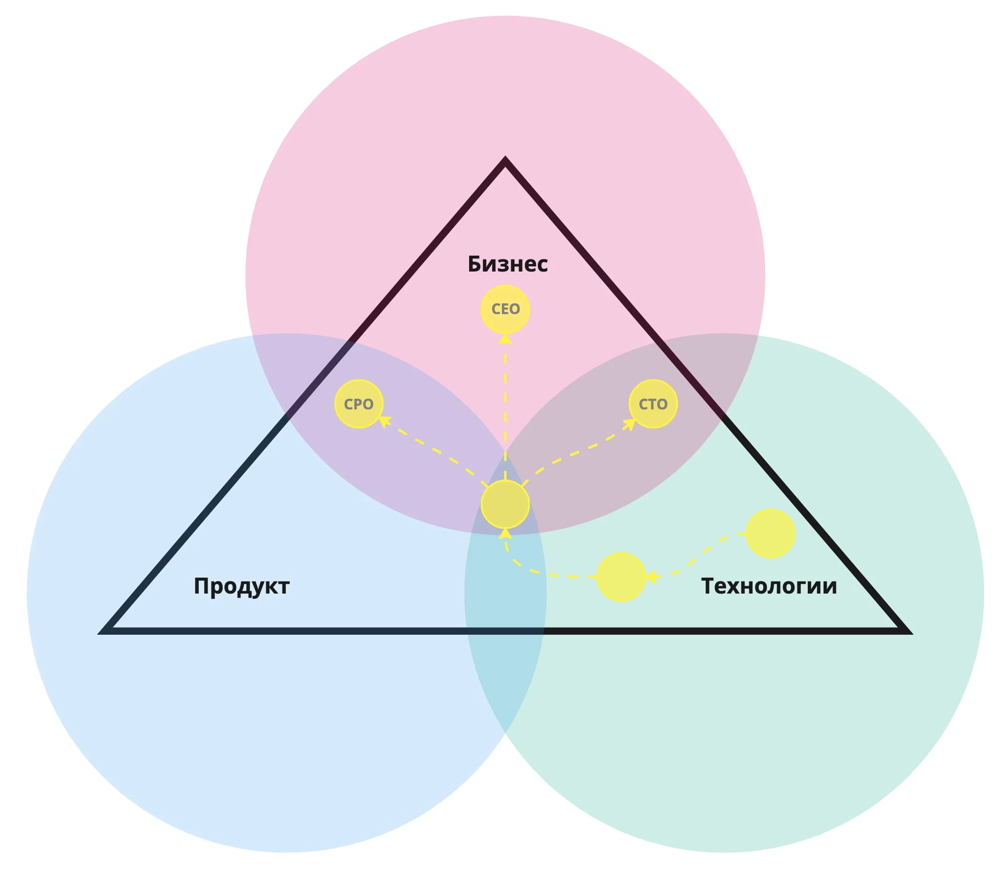


Оригинал опубликован в [Telegram](https://t.me/tarmolov_work/255)


Коллега рассказала мне, как объясняет начинающим руководителям важность роста и развития, используя треугольник "бизнес-продукт-технологии".

Сначала начинающий руководитель лучше разбирается в технологиях. Со временем он углубляет понимание продуктовой работы, а затем и бизнеса. В идеале его знания и навыки должны сбалансироваться в центре этого треугольника.

Такая визуализация напоминает [мой собственный план развития](https://tarmolov.ru/posts/258-postroenie-plana-razvitiya/), но она еще и позволяет сравнивать знания и навыки разных руководителей на одном треугольнике.