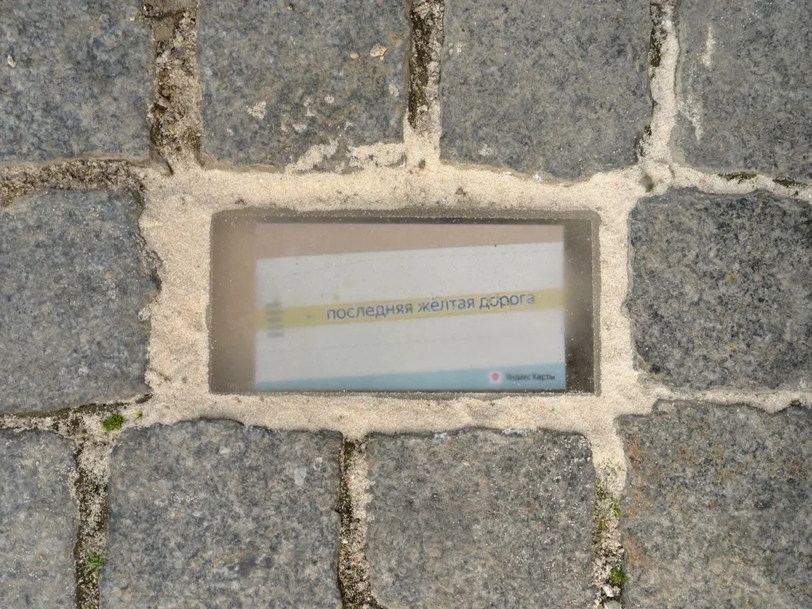


Оригинал опубликован в [Telegram](https://t.me/tarmolov_work/260)


 
[13 лет назад](https://yandex.ru/blog/company/13145) Яндекс изменил свой логотип с «Яndex» на «Яндекс». Это была небольшая революция, которую мы долго обсуждали внутри компании.

Сегодня в Картах происходит похожее преобразование — спустя 20 лет [желтые дороги стали серыми](https://yandex.ru/company/news/01-05-06-2025)! И нет, это не ошибка дизайнера, случайно перепутавшего цвета.

За этим масштабным проектом стоит 22 месяца кропотливой работы команды дизайнеров. Карты стали реалистичнее, детальнее и теперь больше соответствуют тому, что мы видим за окном.

Поначалу может быть непривычно видеть обновленный интерфейс приложения Яндекс Карт. Дайте себе время адаптироваться, и вскоре вы оцените все преимущества нового дизайна.

А для ценителей ностальгии мы оставили последнюю желтую дорогу рядом с одним из офисов Яндекса ;)