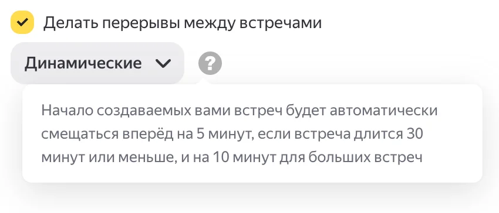


Оригинал опубликован в [Telegram](https://t.me/tarmolov_work/264)


Во внутреннем календаре у нас есть опция: начинать встречи не «с нуля», а с небольшим сдвигом — например, 12:05–12:30 вместо 12:00–12:30.

Сначала меня, как перфекциониста, бесило, что всё «неровно». А потом понял, что это мощный инструмент.

Когда слоты стоят «стык в стык», неизбежно опаздываешь, не успеваешь налить чай/кофе, сделать короткую паузу или записать мысли после разговора — уже бежишь на следующую. Итог — хроническая фоновая тревожность.

Сдвиг на 5 минут даёт:
- пару минут, чтобы договорить и спокойно завершить разговор;
- время на дорогу между переговорками;
- время, чтобы записать договоренности и собрать мысли в кучку;
- возможность сделать "биопаузу" наконец :)

Эти пять минут возвращают ощущение контроля над днём. Для моего календаря — это +100500 к спокойствию. Горячо рекомендую!

P.S. А если встреча длится час, то сдвиг будет аж на целых 10 минут!