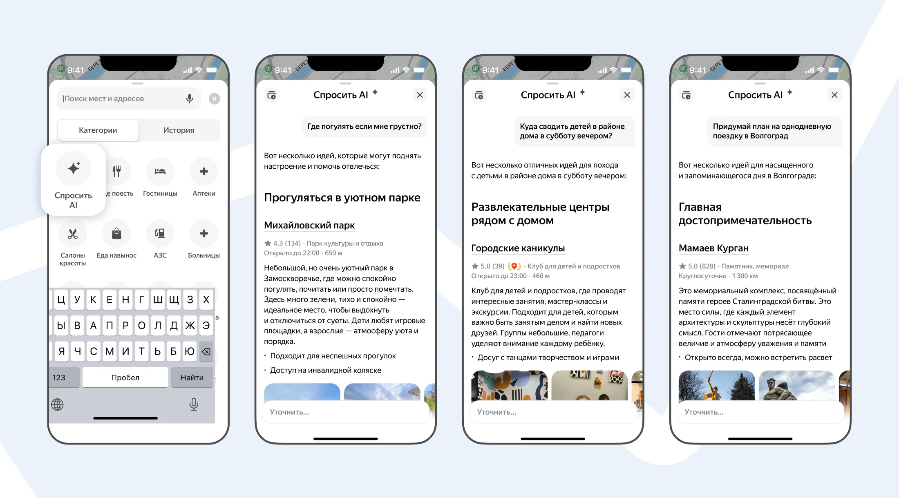


Оригинал опубликован в [Telegram](https://t.me/tarmolov_work/266)


 

Наверняка вы не знали, что при запуске нейронки [мило урчат](https://t.me/denissexy/10941).

Яндекс Карты урчали уже давно, но теперь будут урчать заметно громче: ведь в Картах [появился AI-чат на базе Алиса AI](https://yandex.ru/company/news/11-12-2025-01), доступный по кнопке **«Спросить AI»**.

AI-чат поможет, например, быстро подобрать места под настроение, собрать план на день или маршрут прогулки.

Теперь Карты могут отвечать на более сложные запросы:
— «Куда пойти на выходных, если я фея-фиалка?» (да, это реальный запрос)
— «Где тихо посидеть вечером рядом с центром и вкусно поесть?»

Зайдите в Карты → Спросить AI и попробуйте свой самый странный запрос 😄