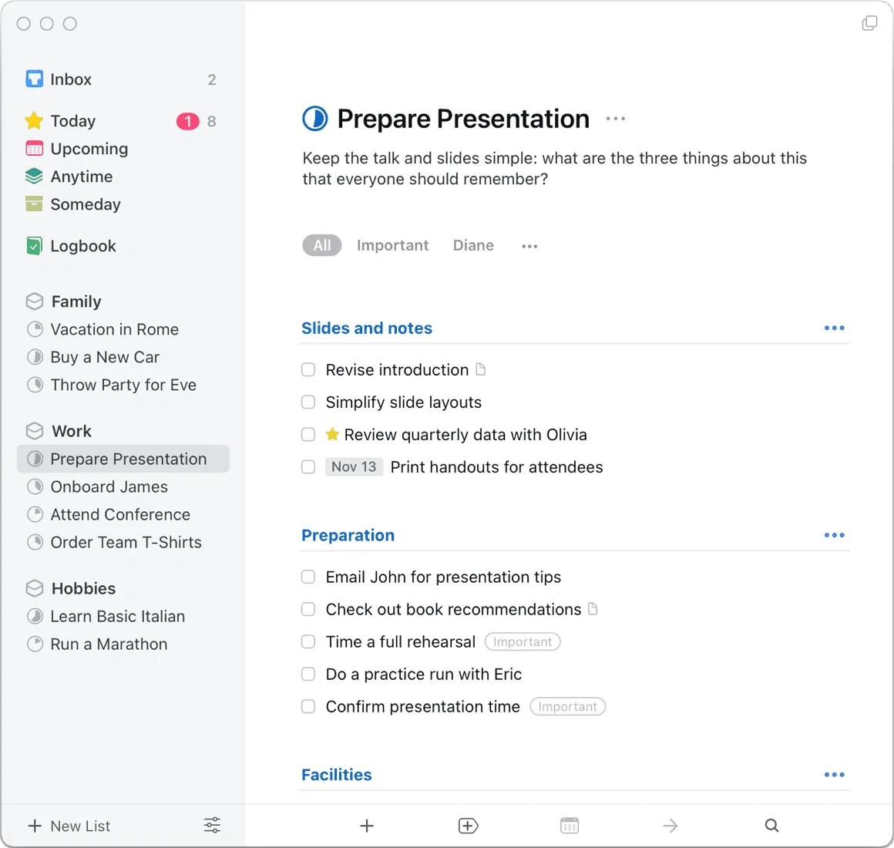
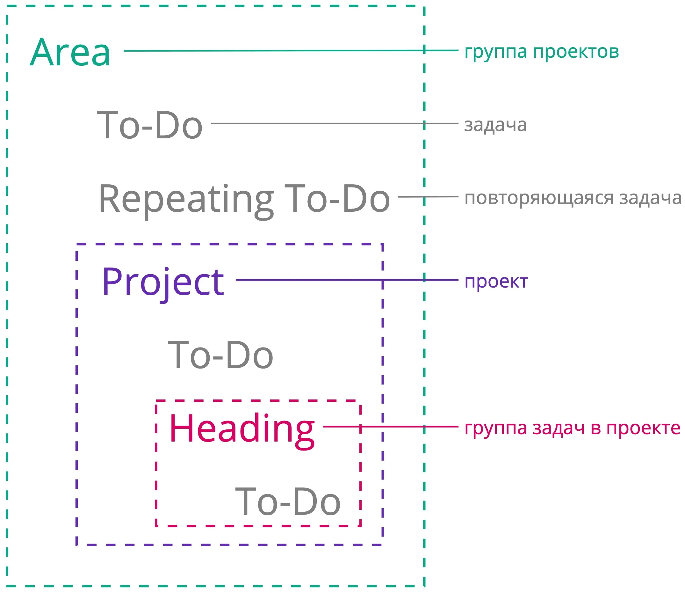
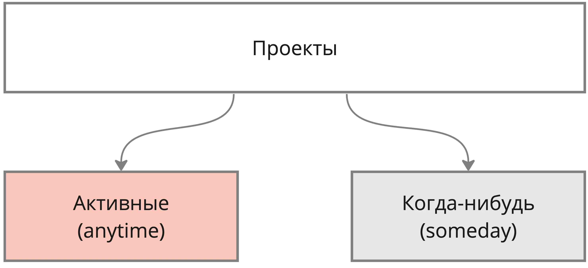
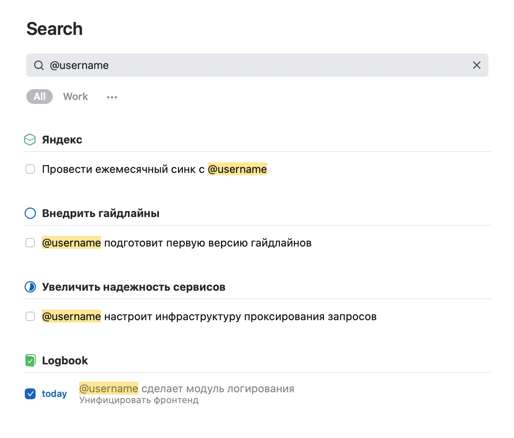
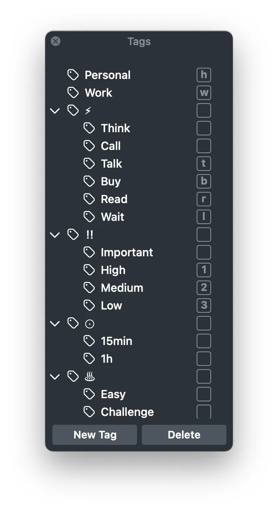

Я использую [Things](https://culturedcode.com/things/) более 7 лет и за это время выработал свою систему управления задачами, которой и хочу сегодня поделиться.

**Важная ремарка:** это приложение доступно только для устройств компании Apple. Но даже если вы не пользуетесь айфонами и маками, то подход, изложенный ниже, можно будет адаптировать и под другие приложения.

# Группировка задач в Things

Для начала напомню терминологию сущностей в Things:

Задачи можно объединить в группы с заголовком, проекты или области деятельности.

У задачи, проекта и области деятельности помимо заголовка можно добавить описание, теги и другую мета информацию.

Я использую Things и для рабочих, и для личных задач. Такой подход позволяет централизованно управлять своей жизнью и не переключаться между разными инструментами.

Проекты “Починить дверцу у шкафа на кухне” и “Запустить оплату парковок в Яндекс Картах” будут в общем списке. Вначале это выглядит странно, но потом привыкаешь.

Мои рабочие задачи в Things больше похоже на оглавление. Я сохраняю всю NDA информацию в [трекере](https://tracker.yandex.ru/) или [вики](https://wiki.yandex.ru/). Если мои задачи из Things вдруг взломают, то злоумышленник не сможет получить доступ к основной информации.

# Области деятельности (area)

Я остановился на следующих группах проектов:

* `Город` — улучшение городской среды (установить парковочные столбики или фонарь, выпрямить покосившийся дорожный знак и т.д.)
* `Дом` — проекты по моей квартире, дому и придомовой территории (починить вентиляцию в ванной, покрасить лифт, установить клумбы во дворе и т.д.)
* `Здоровье` — техническое обслуживание организма (пройти чекап, вылечить зуб и т.д.)
* `Саморазвитие` — расширение знаний и кругозора (пройти курс по аналитике, улучшить продуктовое понимание, поднять уровень английского и т.д.)
* `Семья и друзья` — все, что связано с самыми важными людьми в моей жизни (съездить в отпуск, организовать встречу с друзьями, организовать автополив на даче и т.д.)
* `Финансы` — про деньги в том или ином виде (заплатить налоги, реорганизовать портфель с инвестициями, пройти обучение по финансам и т.д.)
* `Хобби` — занятия для души (поучиться фигурному катанию, заниматься медитацией и т.д.)
* `Я` — фокусные и важные для меня проекты (часто перемещаю проекты из других областей)
* `Яндекс` — рабочие проекты
  * `Яндекс Аналитика` — проекты по аналитике
  * `Яндекс Тестирование` — проекты по тестированию
  * `Яндекс Инфраструктура` — проекты по инфраструктуре
  * и т.д.

Как показывает мой опыт, этих областей достаточно для организации всех возникающих проектов.

# Проекты

**Проект** — задача, для решения которой нужно более одного шага. Например, если перегорела лампочка и ее нужно заменить, то это проект из двух шагов: купить лампочку и заменить лампочку.

На момент написания этого поста у меня 70\+ проектов.

Если количество проектов переваливает за сотню, то ими становится сложно управлять. Тогда я уменьшаю их количество, объединяя несколько проектов в один.

Важно понимать, что в активной фазе (**Anytime**) находится только часть проектов. Другие проекты (**Someday**) находятся в исследовательской фазе, в ожидании зависимостей (**тег Wait**) или же вообще в анабиозе.

Я стараюсь формулировать мои проекты и задачи по [SMART](https://ru.wikipedia.org/wiki/S.M.A.R.T.), но не всегда этому следую.

Например, у меня есть “вечный” проект “Следить за чистотой в доме”. В рамках этого проекта у меня стоят уведомления по чистке робота-пылесоса и мойки воздуха. Можно создавать проекты на каждый год или полгода, но зачем?

Есть проекты, которые больше похожи на области деятельности. Как, например, проект “Улучшить безопасность сервисов”, в котором сгруппированы задачи от нашей службы безопасности. Может показаться, что это вечный проект, но это не так. В рамках этого проекта сгруппированы разношерстные конечные задачи.

Проект "[Запустить оплату парковок](https://t.me/tarmolov_work/100)" имеет более понятное бинарное состояние: запустили или не запустили.

Я делаю, как мне удобно, а не как принято в каких-то системах. Считаю, что не надо кошмарить себя за то, что ваш подход отличается от классического. Относитесь к этому не как к багу, а как к фиче :)

# Задачи

Я создаю задачи только в проектах. В областях деятельности у меня могут быть только повторяющиеся задачи (Repeating To-Do). Например, "Заказать новые фильтры для воды" раз в год или "Передать показания водосчетчиков" каждый месяц (увы, у меня в доме это делается вручную).

В своей [заметке о GTD](https://t.me/tarmolov_work/114) я рассказывал о том, что каждому коллеге я выдал тег для более быстрого поиска задач, по которым мы взаимодействуем.

Но как показала практика, удобнее писать этот логин в названии задачи. Отдельный тег `@username` превратился в название задачи вида `@username настроит инфраструктуру проксирования запросов`. Далее в обычном поиске я ввожу `@username`, и Things выдает мне все связанные задачи, включая закрытые.

# Контексты

Несколько лет я пытался приучить себя к разметке задач контекстами. Контексты по методологии GTD — место и способ решения задач.

Например, задачи за компьютером можно помечать тегом `Computer`, а те, что можно сделать только на работе, — тегом `Work`.

У меня осталось некоторое количество тегов для разделения рабочих и личных проектов, по типу действия (почитать, посмотреть, поговорить), по приоритету и уровню энергии.

Пользуюсь тегами редко. Скорее всего, буду продолжать отказываться от тегов в пользу поиска.

# Контроль

Любая система управления задачами порастет мхом без постоянного контроля и актуализации. Самое страшное — потерять доверие к своей системе менеджмента.

Для себя я выделил несколько полезных рутин:

1. Все заметки по встречам или какие-то идеи я вношу в Things. Заметки можно делать и в блокноте, но мне важно повысить частоту использования Things как основного инструмента.
2. Во время встречи я актуализирую конкретный проект в Things. Это занимает немного времени в рамках встречи по статусу проекта.
3. На встречах 1-1 также актуализирую список проектов и обещаний.
4. Раз в неделю пробегаюсь по диагонали по всем проектам и пингую ответственных в проектах с тегом **Wait**. Иногда эту работу делаю раз в 2 недели.
5. Несколько раз в неделю очищаю **Inbox** в Things, куда я сохраняю разные идеи и задачи, возникающие по пути.

\--

Моя система управления — не идеальна, и можно сделать лучше.

Иногда в ней наступает временный хаос, и статусы по проектам становятся неактуальными. Я воспринимаю этот хаос как разработческие инциденты: они неизбежны, нужно учиться их предотвращать и чинить.
