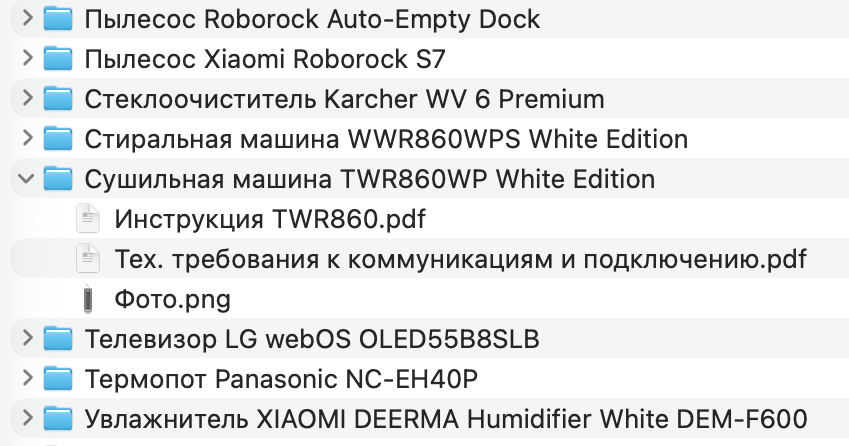


Оригинал опубликован в [Telegram](https://t.me/c/1697479693/272)


Когда покупаю новую технику, коробки обычно сразу выбрасываю. А вот инструкции сохранял.

Они копились на полке, пылились и занимали место. Пользоваться этим архивом было неудобно: если что-то понадобилось, нужно идти, искать нужную бумажку и надеяться, что она вообще сохранилась.

В какой-то момент я понял, что хранить нужно не бумагу, а доступ к информации.

Теперь делаю так:

- нахожу pdf-инструкцию на сайте производителя;
- сохраняю её в папку с мануалами;
- бумажную версию выбрасываю.

Плюсы очевидные: ничего не пылится, не теряется, не занимает место, а нужный мануал всегда можно быстро найти с телефона или компьютера.

Маленький бытовой лайфхак, который реально упрощает жизнь.