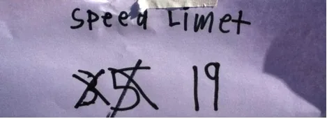

> В 2016 году я подписался на рассылку от компании [Pop Forms](http://popforms.com ). В течение года мне присылали письма с примерами тем для 1-1 встреч.
> 
> Берите их на вооружении при возникновение трудностей с подбором темы на ближайший 1-1 ;)

# Week # 1

 

**What is one thing that I could do to make you more productive?**

Be sure to hold them to one thing.  If they don't have one ready then sit and let silence work for you (try counting to 10 in your head slowly).  Just pause until they tell you something.  In the event they still don't have something you can ask them about the last time they didn't enjoy their job and what could have been done to make it better.  If they are too new to the team, you can try asking them about what they really liked about their old team or office.

**What did you want to be when you grew up?**

This can be a fun question because very seldom did people start out with the vision of ending up where they are now.  As they tell you ask them why they wanted to be that, and when did it change?  How did they end up where they are now?

# Week # 2

 

**Tell me about one coworker that you feel does a particularly good job.**

A lot of people are introverts and won't volunteer when someone has done a great job. Asking them to list specifics can clue you in to great work being done in your organization.

(Bonus: their reasons will give you insight into their own values too!)

When they tell you, ask for more details. What about the person makes them great? Do they make these contributions often? Dive into the details and make it a goal to ask at least 3 follow-up questions about the person they choose.

**List three things that motivate you to do your work each day.**

These motivations can give you some serious insights into what this person enjoys about their profession and your company.

For each of the items they list, do your best to follow up with probing questions. Why does it motivate them? Has that always been the case? Will those still be the reasons a year from now; why or why not?

\*Pro tip: If you have any other topics you want to discuss with your team this week, why not make a note of them now? Arrive to your 1:1s prepared and stress-free.

Easy breezy.

# Week # 3

 

**What is a mistake you made recently that you learned a lot from?**

We all make mistakes, but no one wants to make them twice. It is often interesting to hear what people consider their mistakes because much of the time they weren't things that you have seen or noticed. This can be a great way to compliment them on their personal growth.

In the event it was a mistake that you did notice (or was obvious) this can be a great time to revisit it and talk about how it has changed things or how they have improved from it.

If you have someone hestitant to share, come to the meeting prepared with one of your own mistakes to share - and the bigger (or more recent) the better. You want them to see you as a human, not just an authority figure.

**Are there any areas of your job that you would like additional training in?**

Use this question to identify potential areas for growth and ways you can help people achieve their goals. And don't just think it has to be traditional or pricey training. You can buy training guides, you can give them time during work to read books or take free online courses (like those on Coursera.com), or perhaps even line up meetings with a potential mentor.

# Week # 4

 

**What is the biggest challenge we will face this year?**

This question is intentionally really open ended.  You can take it all kinds of places, and I am always entertained by the different areas people focus - competition and the market, internal process, projects, or perhaps even team dynamics.  Plan to follow up with good questions like:

How would you overcome the challenges?

Do you think there is anything we can do now (that we aren't doing already)?

What would happen if we didn't succeed, do we have a contingency or Plan B?

**Tell me about your long term career goals.**

Do you know their long term career goals? When do they want to retire?  Do they like working on big teams or small teams? How about building out their skills? Do they want to learn new technologies or tools?

If they talk about a position, ask them why. Is it about achievement?  Maybe someone they admired in their past? Ask lots of questions and really listen. Take notes. With each question you ask, wait as long as necessary until they answer it. Dive deep.

# Week # 5

 

**What part of your job do you wish you didn't have to do?**

Everyone has parts of their job that may be less than fun. However, not every employee will be forthright or open about these things.

If you find people resistant to sharing the things they don't like, then you may have a problem (if they are afraid or don't feel like you will listen). If you get the sense someone is holding back then make an effort to remove the risks off the table.

Tell them it's off the record or offer them your own "less than awesome task". If you are worried they don't think you care, explain to them (honestly, now) why you want to address it or brainstorm ways solve it within the limitations of your role and resources.

**What are your top 3 super powers?**

This is a great way to learn what each person sees as their true strengths. And don't let them get away with giving you less than 3. Most people can come up with one quickly, but you can get into the good stuff a bit later.

If you think they are exceptional at something they don't mention, ask them why they didn't mention it and take the opportunity to pay them a compliment. If you agree with their assessment, let them know and try to give an example of when they really excelled. Most of us don't get enough praise and it is a great chance to recognize the areas in which they shine.

# Week # 6

 

**How could your working hours be adjusted to better fit your schedule?**

Flexible work environments aren't always possible, but it is often easy to try to limit meetings or schedule blocks of uninterrupted time. Learning how your team likes to work allows you to be a better advocate for them and also helps to ensure that everyone is as productive as they can be. Win!

**When was the last time you got stuck and needed help at work?  Who/what helped you get unstuck?**

Everyone has hiccups and speedbumps at work. This question can go lots of directions and uncover all sorts of interesting things.

For example, it can help you recognize the contribution of other team members (giving you a chance to praise them for helping), it can open a line of questioning about learning from mistakes, or it can give you an insight into how this person solves the problems that come their way.

# Week # 7

 

**What part of your job do you enjoy the most? And which part do you enjoy least?**

Sometimes this question can lead to really interesting discussions about role definition. As teams grow and shrink, and as projects change, each person's respsonsibilities do too. Revisiting the good things and the bad things can ensure that everything is moving in a direction that keeps people happy and aligns with their goals and motivations.

**What is one thing we aren't currently doing, but could be doing to grow the business?**

Sometimes the best ideas come from the quiet ones, so asking for feedback on direction can uncover fantastic ideas and give you the chance to highlight some innovative thinking on your team.

This is also a great way to reinforce the importance of thinking about their role in the larger context of the health of the organization.

In the event their idea doesn't make sense or wouldn't be possible, resist the urge to tell them. Instead take a line of questions about the potential hurdles and risks. How could you overcome them and mitigate them? Work through the ideas together. Stage this as a hypothetical exercise, like a case study in business school, and then reiterate the importance of focus as you get back to work.

Take a moment now and think about anything else you want to talk about. Make a note so you'll have it at the ready. (If you can find a bike seat to curl up in while you do it, even better!)

# Week #8

 

**What are 1 or 2 things in our team that could be done more efficiently?**

Don't let people get away with not answering. There are always places that could be streamlined, improved, and made more efficient.

If you are having a hard time drawing someone out, suggest something you think that they should be aware of -- but instead of saying it like an answer, ask it like a question. For example, suggest "How about our release process?" If they agree that it could be improved, ask them how. Problem solve together and try to come up with easy wins that might make good objectives in the coming weeks.

**What is one thing that I, or the company, could to do support you in achieving your goals?**

This conversation is predicated on the fact you know their goals. If you don't, then ask them to pick one for you two to discuss today -- and plan to learn the rest of their goals soon!

Buying them a book or online course in that area is a great (and generally inexpensive) way to follow-up and support a goal. Another awesome thing to do is to actually learn a bit about the material or goal, so you can converse with them at a high level about it.

Try to think about some ways you or the company can support the person's goals in advance; that way you can facilitate the discussion even if the person doesn't have any suggestions of their own.

These questions are a fantastic opportunity to get some opinions and ideas moving upwards, and to have your team show you how you can all do better. Not too shabby, right? So make sure to take their answers seriously and let them know when they've knocked your gol'dern socks off with their ideas.

"Courage is being scared to death...and saddling up anyways." -- John Wayne

Lots of people are afraid or intimidated when it comes to giving upward or organizational feedback. Do your best to put them at ease and welcome their input, and don't take offense at their suggestions.

Great ideas come from everywhere, so if someone on your team has a great idea -- don't ignore it. You'll all be better for it. Now, help me get this 10 gallon hat on and we'll ride off into the sunset.

# Week # 9

 

**When have you had the most fun at work? (And it doesn't have to be this company! It can be past roles too.)**

This is a great way to get a feel for what the person values and enjoys in the workplace. Do they talk about accomplishing things and celebrations? What was their role in the celebratory accomplishment?

Or is their memory of an event so fun because it was so non-work-related?  Maybe they felt like they were getting away with something (like ski trips during the week)? These memories are important ones and can give you good ideas on ways to reward your team, or things you can do for that individual specifically.

**Generally speaking, are you happy being employed here?**

This can be hard because pretty much everyone will tell you yes. That is out of fear, generally, because people don't want to seem ungrateful. If they say yes (and you're sure you believe it) ask them why. Ask them what makes this different than past jobs. Ask them if they would want to recruit their friends.

If they say no (or an unconvincing yes) ask them how this job compares to past jobs. Are there any other companies they know of that are doing cool things? How do they describe good companies or cool jobs? What are the traits they choose to share? These little tidbits can actually clue you in on lots of ways you may be able to make things better for them.

This week's 1:1s are a great chance to think about how your team members feel in their current roles and how you can make their future even brighter.

Work is where we spend so much time. Make sure you're thinking about how happy your team members are to be there, and that they're speaking up if they're not.

# Week # 10

 

**From a resources standpoint, is there anything that would help you do your job better?**

This is a very tactical question and is worth asking because you never know when someone will need a new computer, or maybe just better notebooks and pens. If they don't have a good answer of something specific, you can still get value by turning the question to more intangibles.

For example here are a couple of ideas. How about asking what meetings or information would help them be more effective? Or ask about mentors and exposure to senior leaders. Sometimes these lines of conversation can expose little opportunties that show you listen and care, and almost always fall in budget.

**Speaking honestly, what is one criticism you would have for me?**

Be prepared to listen on this one. One tip is to start the conversation with a statement like, "I want to be good at my job too, and I can only do that with feedback, so any ideas or suggestions are very welcome."

Be sure to not be defensive and to really listen. Even if you don't agree with their feedback, say "thank you", and then process it on your time later. Every viewpoint has value, even if you don't agree with it, and it will likely uncover a chance for you to improve, and how awesome is that?

Getting feedback is what makes us better at our jobs. Asking can be scary -- and the answers can be surprising -- but just keep your cool in the moment and be gracious.

"What I believe is that all clear-minded people should remain two things throughout their lifetimes: curious and teachable." -- Roger Ebert

Roger's hit the nail on the head. Go get 'em, hot shot!

# Week # 11

 

**If the need should arise, do you feel comfortable filling any roles other than your own in the office?**

Succession planning and transitions are a key part of any leadership role. Thinking through how this person sees their skills and the roles of those around them can help you plan for potential contingencies.

If you aren't worried about this type of planning, use this to talk about future roles and how they would want to evolve their skillset to move into a different role in the future. Or if they don't see that happening, find out why.

**Have you been asked to do anything as part of your job that pushed your out of your comfort zone?**

Hopefully the answer is yes! The good part of this quesion and discussion is learning about the specifics and details of the work or project that pushed them. Learning how they handled it, if they liked it, and how they overcame challenges can be insightful and provide chances to discuss future projects or areas for improvement.

If the answer is no, then ask about why and what they see could be future opportunities for them to grow.

# Week # 12

 

**List the top three things that you feel waste time during your day.**

Every job has time-wasters, and part of your role as a leader is to deal with these and improve them if you can. Before the conversation gets going, you may want to position the conversation as a collaboration where you both work together to come up with ways to address issues.

You may not be able to address all of them, but I would encourage you to follow up and improve things if you can. It will make your team happier and more productive.

**Without naming anyone specifically, do you know of anyone in the office that is unhappy?**

Sometimes your team can be very clued in where you are missing things. Be sure not to pressure them to tell you why they think this person is unhappy, but do ask them if they think it is organizational, cultural, specifc to the individual or role, or something else.

Ask about how it could be better. If some of those changes were made would the individual be happier?

Just don't make it specific or make them uncomfortable, and most importantly keep it to yourself. Relationships are about trust, so use this as a chance to find ways you can make things better, not to single people out. Focus on the overall health of your team.

# Week # 13

 

**How often do you think staff meetings are needed to keep everyone on the same page?**

Many companies fall into the situation of having meetings for the sake of meetings. However, sharing information and keeping everyone up to date is a key and important part of an leadership role.

Get a feel for the frequency and type of information that your employees need and want. This can be a great way to make sure that time is being used effecitively and maybe even who on your team needs more touchpoints than others.

**Are you making as much money now as you hoped when you accepted the job?**

Most people are happy with their compensation when they accept the job, but then things change and no one's salary seems to grow the way they want it to - so be prepared. That being said, hearing your employee's perspective can lead to some really honest conversations about compensation.

The last thing you want is to lose someone over money, so use this tool as an excuse to bring it up before it comes up in their exit interview. Just be prepared with how to answer it if you aren't in the position to just give them a raise. Maybe there are other things you can do to help them be more happy with their compensation and role - think flex time, training, or advancement opportunities.

# Week # 14

 

**What makes for a great day at work?**

Everyone is motivated by different things. Understanding what makes a great day for your teammates is an important ingredient to create an engaged team.

A good follow up question is to ask is a simple "Why?". Try to dive deep and ask 5 whys to get the root of the emotion.

Also pay attention to what they don't say. Don't dwell on the negative, but if they start their reply with "A good day is when \[fill in the blank\] doesn't happen", then perhaps it is time to look at bit closer at whatever \[fill in the blank\] is. Brainstorm some solutions to address it.

**If money were no object, what would you do every day?**

This is a great question because it allows people to dream. This can be a hard one with new people that you don't have yet rapport with, so if you find the answer lacking, be ready to offer your own version. What would YOU do if money were no object? And don't give them some canned answer; be vulnerable and willing to share your truth.

# Week # 15

 

**Do you feel like you receive feedback often enough?**

It is surprising to hear the answer to this question sometimes. The goal is to get a read on how often the person really needs feedback from you.

If they want more feedback, a great follow up is to ask how often and how they would like the feedback. Some people want to have scheduled meetings that are more focused on their performance, whereas others want small suggestions on how they can be better.

**Who do you really admire?**

We often look up to people that have careers or trajectories that we want for ourselves. Be prepared to ask questions about what they like about the person, and why. How do they see themselves growing to be more like them? What skills, accomplishments, or traits are they trying to cultivate? (Maybe there are chances for you to help.)

# Week # 16

 

**What is one thing we could do to make the office more comfortable/enjoyable/fun (or just better) without spending much money?**

It is good to hear ideas on ways to improve the space. After all, many people spend more waking hours at the office than anywhere else. You would be amazed at the great and creative ideas people have.

If you don't have a big budget, let them know, or be willing to lobby for improvements that make sense. Try to understand why they want what they are suggesting - is there another way to accomplish the same goal? Don't be afraid to talk through solutions and ideas together.

**How well do you feel like you relate to you coworkers? Do you view them as friends?**

Employees are more engaged and often more productive when they have good relationships with their teammates. Helping people cultivate these friendships, and repair burned bridges is one of the greatest accomplishments you can have as a leader.

Be a good listener. Try to understand where the person is coming from and consider how you can provide perspective for misunderstandings. Cultivate opportuntiies for collaboration (and hopefully better relationships) in the future.

# Week # 17

 

**On a scale of 1-10 what level of loyalty do you feel to the company as a whole?**

This is a great question because it can help you understand commitment to the company. My favorite follow-up question is to take whatever number they say and pick a number a few notches lower (so if they say 7, I would pick 4) and ask them "Why aren't you a 4?". Then they will tell you all the reasons they like the company.

And the best part of it isn't just that you understand their level of commitment - but you will understand what loyalty means to them too.

**Name the first two things you would do if you were put in charge for a day.**

This question really has two interesting parts - what they say (which should be looked at too) but also what they view as the responsibility of the leader. What do they think that person can do that they can't do?

Chances are that person probably can't do these things either, so it can be a great chance to educate them on why those things might not happen and some of the challenges of influencing people (without ruling with an iron fist).

These questions invite answers that might make you uncomfortable - but that's not a bad thing! Be open to accepting any answer and doing a bit of learning and introspection yourself. Focus on asking smart follow-up questions to ensure you understand where each person is coming from.

# Week # 18

 

**What goals do you feel like you have accomplished professionally since you began work here?**

Ideally everyone on your team is accomplishing work that is resume-worthy. A natural segue from this question is to dive into what they want to accomplish next and make it forward-looking. Or you can talk about their feelings about those accomplishments - were they stretched, or was it pretty easy? What have they learned?

**In what ways could we improve communications around the office?**

Listen up here. Oftentimes, these suggestions are easy things, and the more information people have the better decsions they make. Great companies are comprised of lots of great local decisions made by everyone on the team.

# Week # 19

 

**Do you enjoy office functions (parties, dinners) or would you rather be rewarded in some other way?**

It seems like executives love throwing parties and celebrating things, but the fact of the matter is that some employees would prefer to be rewarded and recognized differently. Hopefully they will come with ideas or suggestions, but if not, you can always ask about things they liked in past jobs, or even perks at other companies.

Enlisting their help will help them see the challenges (budget, time) and maybe help you come up with a better alternative for future rewards.

**How well-received do you feel your opinions are when you offer them up?**

Great ideas come from all parts of the organization, and if you aren't hearing someone, then you are missing out. Use this time to talk about meetings, ideas, and opinions about how decisions are made in your organization.

If the person has great ideas and doesn't speak up, use this as a chance to come up with strategies to help them feel heard (email often works great for people uncomfortable in meetings). Use this as a chance to learn who might be dominating the conversation and follow up to give them a few ideas to help solicit thoughts from others (writing ideas on the whiteboard, or asking people outright).

# Week # 20

 

**Sometimes an organization gets so focused on the tactical and day-to-day that they forget to take time to focus on being creative and fostering innovative ideas. What can we do to be more creative and innovative?**

This is a great exercise to work together on. Start with the question of if this is even a problem, and if not, why? What are the good aspects of your culture that makes innovation possible?

On the other hand, if it is an issue, try brainstorming ways to spark a little more inspiration into your day-to-day. Encourage them to share their best ideas for building a better environment for creativity.

**How often do people ask you for help? What do they ask for and how long does it take you?**

It can be amazing to learn about how much help employees give to one another. Sometimes you will come across the person who spends the better part of their day helping their team (or even other teams) get work done. Understanding this percentage can help you find ways to free up their time with process, documentation, or even just coach them to help differently (teach a man to fish....). This can also be an opportunity to thank them for being a team a player too.

# Week # 21

 

**What are you doing really well that is moving you towards your career goals?**

This question helps spotlight a core goal and the person's ability to execute towards it. What is this person naturally good at doing? Detailed and standardized operations? Leading and motivating other people on their team? Analytical problem solving and numbers?

What is it that someone does better than the average person that can help them achieve their aspirations?

This is also a great opportunity to check in with their goals, and make sure they are completing tasks that move them in that direction. It can also help them see what goals could be altered to better fir their natural strengths and likes.

**What parts of the business would you like to be more involved in or learn more about?**

Oftentimes we want people to focus on what they are best at, but the drive to get things done can also hold them back from exploring new things. Take a minute to brainstorm and talk through ideas, developments, or projects in the company that your teammate might be interested in learning more about in the future.

After the meeting will be the hard part though, because then you have to figure out how to make it happen... 😃

# Week # 22

 

**Are you having fun? Tell me about the most fun you've had working here.**

This is a great way to gauge a person's current interest and level of enjoyment in their job. How long ago did they last have fun? Was it related to their work, their peers, or maybe getting away from their work or peers? If they can't remember the last time they had fun, that is important. But let them think, and try to get them to come up with an answer.

Great follow up questions: What made those moments so enjoyable? What could be changed about your current role to make it more fun?

**What is most important to our business -- mission, core values, or vision?**

Uh oh, this one might be a good question for you too! Do you know what your company's mission, vision and values are? Or are they not important because you have something else instead? What do you think is most important?

Be prepared to talk about where the company is headed and how this information is shared with your team.

# Week # 23

**Are you happy that you left your previous job for this one?**

This is a question some people may feel compelled to just say "yes" to because you are their boss. It's important that you help make them feel comfortable being honest. Listen; don't interrupt; don't jump to defend yourself or the company. Draw out answers by asking follow-up questions like:

Are you doing the kind of work you had hoped to do when you left? What drew you to this company, and do you feel like your expectations were met? Are there things you miss from your old job (benefits, opportunities) that we could do here?

**How long can you see yourself working here?**

Another slightly intimidating one, but if they are hesitant to answer, you can focus their answers on their goals and priorities. What are their long-term goals? How is their work here pushing them towards those goals, and what will they need to do next to achieve their goals?

And if they feel like they will be leaving soon, think about if it is time to start creating an exit strategy. Are there any specific reasons why they want to leave? Maybe team or culture problems with the company? See if any of their problems are ones that you can fix. And if they are just thinking of moving forward because it is time for them to go, then it's time for you to start thinking about replacements and team changes that are on the horizon.

# Week # 24

**List 3 things you would like to see when you come to work every day.**

This is such a great open-ended question, and you'll be amazed at what each person says. Take a moment and come up with your three things too; that way you can have a two-sided conversation about ways to make things better.

**Is this job fitting in well with your life as a whole?**

Work-life balance is a really important thing for you to stay on top of.  Obviously, you aren't trying to interfere with your employees' personal lives or happiness, but it is important to know if you are unknowingly affecting it. You may be surprised to hear people's responses, so it's important to remember just to listen and not make people feel judged for their answers.

Good follow-up questions: do you feel free to leave when your work is done? Are there things you used to do that you are now not able to? Are you happy?

# Week # 25

 

**Pick a question to ask your manager about their background or career. \[for the employee to come up with!\]**

This week be prepared to share a bit about yourself with your team. Great leaders are ones that are authentic and more than just a supervisor -- they are also people, so this is the chance to share a bit about yourself, what makes you tick, and the accomplishments and achievements that landed you in your role.

**What's the best compliment you've ever received at work? \[this one's for you to ask! phew, back to normal. :)\]**

This is a great question to gain a little insight into compliments that stick with someone and why they matter. Understanding the things that stand out in their mind from their background can help you do a better job motivating them in the future.

It can also help you see what sort of projects or accomplishments stand out to them. Pay attention to the conditions of the compliment and who it was that gave it to them. Sometimes praise from people high up in the organization can stand out the most -- and the best part about those compliments is that they are usually free and easy to give.

# Week # 26

 

**Tell me about the last time you felt proud of yourself to solving a problem on the job.**

It helps to understand what someone thinks is worthwhile, especially if it is something that happened recently that you may not have noticed (doh!). If they give you an example from far in the past, ask them about something in the last year, or last 6 months.

Make an effort to understand what they consider pride-worthy, and ask for the details around it. It may help you do a better job assigning meaningful projects in the future.

**Is the job you perform on a daily basis what you expected when you took it?**

Relationships can fall apart on missed expectations. Sometimes it helps to check in and understand what expectations were and how they have changed. If a person has been in a role for a while, it can help to revisit what they thought it would be and what characteristics are different. They may be a good different, or a bad different, but you will never know until you ask.

# Week # 27

**In your opinion, is the staffing level in the office sufficient to keep up with the workload?**

Sometimes people feel overworked, or maybe they notice that something isn't being handled well. Asking them outright can help you understand where things aren't running as smoothly as they could be.

Be sure to listen patiently, and if hiring more staff isn't in the future, try brainstorming together some other ways to solve the problem. You are on the same team, after all, and who doesn't want things to run like butter. Mmmm, butter.

And if they don't have anything to offer? Ask them if things are overstaffed then. Wasted work is just as inefficient as people being overworked.

**What about the physical arrangement of the office do you like? What would you change?**

Yes, it may not be in your purview to make changes. However, you won't really understand how people like to work unless you ask them. And surveying your team for their ideal working conditions is a great way to get your head around what sort of environment makes them most productive.

Talking about these things can also help surface some creative solutions for more flexible working arrangements, additional furniture (whiteboards or bean bags, for example), or even shuffling seats.

# Week # 28

 

**If you were to give yourself a rating (1-10) today, what would it be?**

Get ready for a tough conversation here. Talking about performance is always a challenge, both for you and for your employee.However, it is good to be checking in on these things on a regular basis.

To start, let them tell you their rating before you do anything else.

Ask them why it wasn't lower. Ask them why it wasn't higher. What do they think they need to do to maintain that rating?

You don't need to confirm or deny the rating, per se, to make this meeting effective. However, it is good to set expectations on where you might rank them or why you don't agree with their number, if it feels necessary.

# Week # 29

 

**List 2 things that you see being done inefficiently around the office. Is it worth making them more efficient? Why or why not?**

In the midst of everything that goes on every day at work, sometimes we overlook things that could be done a little more smoothly. What do your employees see at lost potential for efficiency?

This is helpful not just for brainstorming options for streamlining, but also for seeing places where your reports think there are problems (even if things are done that way for a good reason). Take the opportunity to explain why things function the way they do, if changes aren't possible.

Work together to talk through any observations and try to see if there is some low-hanging fruit you might be able to tackle together to make some improvements.

**If you sat in on an interview for a prospective employee, what one question would you ask them?**

Not all employees are able to sit in on interviews, but it can be fun to learn what they ask and how they would judge new recruits. It's a good exercise for people who have never done interviews too, to consider how they would do it.

Ask them about why they would ask those questions, and what they think a good and bad answer might be.

# Week # 30

 

**Do you think the salary possibilities within this company are enough to satisfy you long term?**

Money is a touchy subject for most people (who doesn't want more?). However, a good leader knows what people want and can represent them accurately.

These days, great people can almost always get higher paying jobs elsewhere, so it is important to understand what they expect for raises and salary increases. If they don't think the possibilities at your company are reasonable, try to understand why and where they would expect to make more.

This is a tough conversation, and it isn't your job to judge, make commitments, or even assess their opinions. Just listen, ask questions, and try to understand where they are coming from. It will make you a much better advocate for them in the future.

**Tell me about a recent situation you wish you would have handled differently.**

We all make mistakes, and it's important to be able to talk about them objectively and learn from them.

Make sure they share something. Don't tell them how to fix it, though. Instead, ask them how they plan to prevent it in the future. Make suggestions, but try to do it in the form of questions. "Did you think of...." or "I know someone once fixed that by doing ______, would that help?"

# Week # 31

 

**What is something we could do as a team to improve the company?**

Team activities are great ways to create bonds between teammates, and what better way do some bonding than to take on something that will make the company better?

If the employee doesn't have any ideas ready, ask them about some of the things that aren't "great" about the company. What do they think needs improvement? What could make those things better? Brainstorm problems together, and (don't skip this second step!) then come up with some solutions.

**What is an example of a "little thing" that really impressed you recently? (For example, great customer service or a well-designed product.)**

There are tons of examples of meaningful little things. For example, my OXO mixing bowl has a non-stick bottom for fierce mixing. Apple products are a delight to open because the packaging is designed with that moment in mind. My dentist sends appointment reminders via email and text messages.

It is these little things that can make a user experience great and it can be fun to talk through examples that we have seen. And sometimes they give you great ideas for your own products and services.

# Week # 32

 

**Do you feel the work is evenly distributed across the team? Is there anyone carrying too much? What are some ways we could even things out?**

I know you are busy and this might seem minor. However, it is really important to understand how work is distributed among your employees, and the best way to do that is just to ask every person on your team.

Gauge how your people feel about the distribution of work. Is there anyone taking on an bigger burden than they should? Do they realize it? Is there anyone not doing enough? Do they realize it?

Talk through strategies to get others up to speed or how to work more collaboratively to remove any bottlenecks. It will make everyone more efficient in the long run.

**Are you uncomfortable giving any of your peers constructive criticism? If so, why?**

Not all teams gel together the way we wish they would. Understanding what relationships are strong and which ones are less so can help you have the right conversations to improve them.

Relationships are like filmstrips. The more someone interacts with someone else, the more authentic and trusting they can be. However, one negative interaction may require a lot more positive ones (sometimes 6-10) to counteract it.

If you can help each teammate understand how they can be a better team member, and help them get to know the people they don't know well, you would be amazed at how well you can work together as a cohesive team.

# Week # 33

 

**What are your big dreams in life? Is this job getting you closer to reaching them?**

Hopefully everyone on your team will answer yes to the last question. Whatever they tell you, though, give them your absolute undivided attention. If you think you will be distracted by your phone or someone else in the office, take your meeting elsewhere.

Sharing your dreams with someone is a really hard thing to do and it makes a person feel very vulnerable. So earn that trust. Keep what they say confidential and be a good listener. And whatever you do, don't assume they won't be a good for a promotion because they want to be, say, a fisherman.

They may still really want that promotion and the fisherman dream doesn't come into play until age 60. So don't let their honesty impact your willingness to work with them.

However, do try to understand that planned path so you can help them achieve it. It isn't your job to critique their path or steer them in another direction; this conversation is about \*understanding\* the path they want to take so you can help them along the way.

**Have any outgoing employees expressed specific issues to you? What were they?**

Exit interviews rarely tell the whole story about why someone left. People want to leave on good terms, so they might not be as candid with you as they would be with their peers on a day-to-day basis.

Their peers might have also heard firsthand about some of the issues the outgoing employee was having before they left, which could shed some light on what pushed them to finally leave.

If it makes the employee feel uncomfortable to call out a specific former employee, tell them they can keep it anonymous and just talk about the issues expressed by outgoing employees in general, rather than specific people.

# Week # 34

 

**What is one thing that could be done to make you feel more 'at home' in the office?**

We spend a lot of time at the office, so it matters that your people feel comfortable there. After all, we all have little things that help us be a little bit happier or more productive -- things like coffee or hot drinks, good lighting, or a comfortable space to work in.

And while you probably don't have the budget to completely redesign your team's part of the office, there are lots of small touches you can make. You can also ask the employee to help you brainstorm cost-effective ways to make the office more comfortable, so that they are part of the solution and get an insight into working with your team budget.

**Who in the office do you think has knowledge that you could benefit from?**

People who are ambitious and care about their jobs are always hungry to learn, so this is a great way to facilitate that. I

t's also a way to find out where people's interests lie and how they are thinking about their role, judging by which people and departments they would like to learn from. That knowledge can help you focus their future work to match their goals. Look for opportunities to make introductions, get them into meetings, or help your employee work with a specific person or department on a future project.

The more well-rounded your employee becomes, the better they will understand the business as a whole, as well as their career paths, which is a great win for your team. And it is great to be the person who helped make that new knowledge possible. :)
